# Presentation du framework FLASK 

## Créer un projet Flask

Site officiel [https://flask.palletsprojects.com/en/2.2.x/](https://flask.palletsprojects.com/en/2.2.x/)

Flask est un micro-framework web python (Python v3.7 et versions ultérieures)
- développement rapide et sécurisé de petits sites web
- utilisable pour des applications plus ambitieuses à l'aide d'extensions pour structurer et développer des fonctionnalités particulières.

Une application Flask est une application 100% WSGI (**_Web Server Gateway Interface_**). Elle possède une organisation simple où elle reçoit directement les requêtes du serveur WSGI et les traite. Selon l’URL transmise, elle déclenche le **_Callable_** de réponse concerné.  

La réponse peut être une simple chaîne de caractères ou correspondre à des fichiers HTML particuliers, les **_templates HTML_**.

Un **_template HTML_** est un gabarit qui définit la structure HTML de la page. Il peut être construit à partir d'un autre **_template HTML_** par héritage. Il peut aussi en intégrer d'autres. Il peut déclarer des variables pour insérer des données transmises par le **_Callable_** dynamiquement. Il peut exécuter des structures de contrôle comme des expressions conditionnelles, des boucles, ... . Il peut déclarer des blocs qui seront éditer par les autres *templates HTML* qui s'appuieront dessus par **_héritage_**. 

Le moteur de template **Jinja2** assure la gestion et le fonctionnement des *templates HTML* dans **_Flask_**.

&nbsp;

### **Préparer l'environnement**

Pour créer une application web **_Flask_**, il faut tout d'abord définir le dossier d'accueil du projet, puis y accéder.  A l'intérieur, il faut créer un environnement virtuel Python puis l'activer. Une fois fait, on commence par mettre à jour la base de paquets du gestionnaire `pip`.

```bash
# Création du dossier d'accueil du projet
mkdir prj_acd
cd prj_acd

# Création de l'environnement virtuel python
python3 -m venv acd_env
#démarrer l'environnement virtuel
# sous linux
source acd_env/bin/activate 
#sous windows
projetflask > .\prj_venv\Scripts\activate


# Mise à jour de la base du dépôt
python -m pip install -U pip
```

&nbsp;

Le principal paquet à installer est le paquet `flask`. Il faut l'installer dans l'environnement virtuel à l'aide du gestionnaire de paquets python `pip`._

```bash
# installer le paquet flask dans l'environnement
pip install flask
```

&nbsp;

> _**Remarque** :<p>Le paquet **_flask_** est installé dans le dossier `acd_env/lib/python3.10/site-packages/` de l'environnement virtuel.</p><p>Des dépendances ont automatiquement été installées (**click**, **itsdangerous**, **jinja2**, **markupsafe**, **werkzeug**).</p>_

&nbsp;

### **Dependances installées**

Le rôle respectif de chaque dépendance est décrit dans la documentation au lien [Installation](https://flask.palletsprojects.com/en/2.2.x/installation/#install-flask)

- **_Werkzeug_** : implémenter du serveur WSGI et gérer le routage d'URL
- **_Jinja2_** : moteur de template HTML
- **_MarkupSafe_** : sécuriser les données transmises pour se protéger de certaines attaques
- **_ItsDangerous_** : signer les données pour assurer leur intégrité et protéger le cookie de session

&nbsp;

---
## Créer une première application Flask

**_Flask_** permet de créer une application web WSGI dans un seul module python qui intégrera toutes les fonctionnalités. Il suffit d'importer et d'instancier la classe `Flask` en la liant au module courant (argument `__name__`) pour créer l'application (objet `app`). Le lien avec le module facilite l'accès aux ressources utilisées, template HTML, fichiers statiques, ..., et simplifie l'usage de l'espace de nom défini par l'application.

L'URL (*Uniform Resource Locator*) est au centre du traitement des requêtes pour décider de l'action destinée à construire la réponse.

&nbsp;

> _**Format d'une URL**<ul><li>**URL standard** → <kbd>`protocole`</kbd>://<kbd>`domain`</kbd>/<kbd>`resource`</kbd>?<kbd>`key1`</kbd>=<kbd>`val1`</kbd>&<kbd>`key2`</kbd>=<kbd>`val2`</kbd></li><li>**URL formée** → <kbd>`protocole`</kbd>://<kbd>`domain`</kbd>/<kbd>`resource`</kbd>/<kbd>`val1`</kbd>/<kbd>`val2`</kbd></li></ul>_   

&nbsp;

On déclare les fonctions chargées de traiter la requête et renvoyer la réponse. Ces fonctions sont appelées des **_vues_**. On les décore avec le décorateur python `@app.route()` lié à l'instance de l'application.  Le premier argument du décorateur est la partie`resource` de  l'URL associée pour activer la vue.

&nbsp;

> _**Exercice**<p>Dans le dossier du projet `prj_acd`, créez un dossier nommé `appli1` pour implémenter  à l'intérieur une première application de même nom. Créez le module python `appli1.py` contenant le code suivant.</p>_

&nbsp;

*Code du module `appli1.py`*

```python
from flask import Flask

app = Flask(__name__)

@app.route("/")
@app.route("/accueil")
def index():
    return "<h1>Bienvenue dans la formation Flask</h1>"

@app.route("/emploi/<user>/<job>")
def emploi(user, job):
    return f"<h2>{user} occupe un poste de {job}</h2>"

@app.route("/profil/<string:user>/<int:years>")
def  profil(user, years):
    return f"<h2>{user} a une ancienneté de {years} année(s)</h2>"
```
&nbsp;

L'instance de l'application se nomme `app`. On peut la lancer en utilisant, dans une console avec l'environnement virtuel python activé, à partir du script `flask` livré dans le paquet de même nom.


```bash
flask --app appli1 run
```
&nbsp;

> _**Remarque**<p>Il n'est pas utile de préciser le nom de l'instance s'il elle s'appelle `app` ou `application` ou si vous avez défini une fonction `create_app()` ou `make_app()` (notion de *factory*, fonction dans laquelle l'instance de l'application est créée - permet des instanciations multiples de l'application).</p>_ 

&nbsp;

*fig.1 - Lancement de l'application Flask*

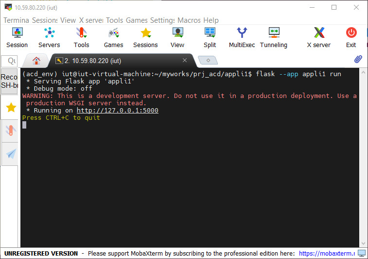

Le serveur web WSGI est lancé sur la boucle locale et écoute par défaut sur le **_port système 5000_**. Le message de démarrage du serveur s'affiche dans la console et précise l'URL d'accès à utiliser pour consulter l'application. On constate également que le mode n'est pas activé.

&nbsp;

> _**Exercice**<p>Testez localement avec un navigateur les différents URL possible sur la boucle locale, avec ou sans erreur.</p>_

&nbsp;

*fig.2 - Affichage de la page d'accueil*

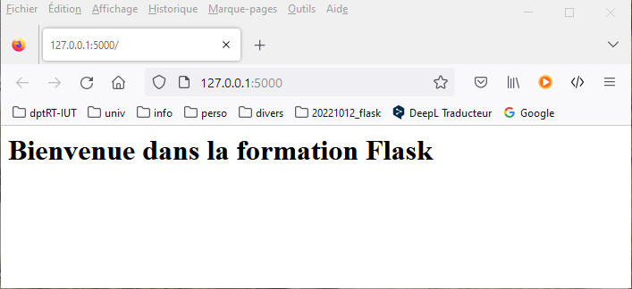

&nbsp;

*fig.3 - Résultat de la consultation pour l'URL `/emploi/Bruno/formateur`*

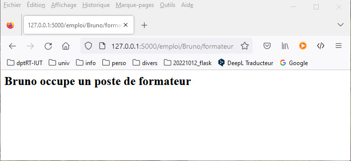

&nbsp;

*fig.4 - Résultat de la consultation pour l'URL `/profil/Bruno/22`*

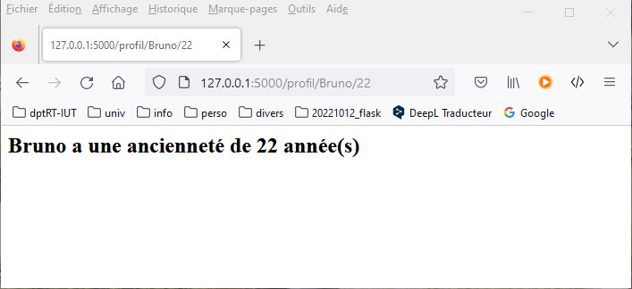

&nbsp;

Pour que le serveur soit accessible depuis le réseau, il faut utiliser avec le script de lancement `flask` l'option `--host=0.0.0.0*` sur la commande `run`. Dans ce cas, il faut ouvrir le port d'écoute dans le firewall de la machine serveur. Le message de démarrage indique les interfaces réseau à l'écoute des requêtes clientes.

```bash
# configuration du firewall sous ubuntu
sudo ufw allow 5000/tcp
sudo ufw reload
#Sous windows on n'a pas besoin de changer le paramétrage du firewall

# script de lancement
flask --app appli1 run --host=0.0.0.0
```

&nbsp;

*fig.5 - Lancement de l'application Flask en mode réseau*

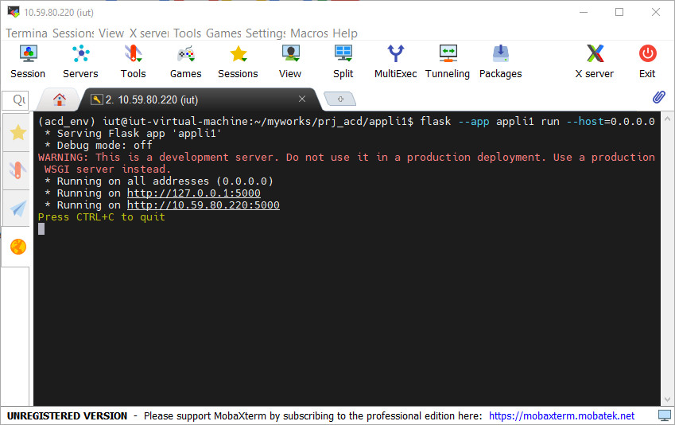

&nbsp;

> **_Exercice_** : _<p>Tester depuis votre poste de travail Windows avec un navigateur les différents URL possible sur la boucle locale, avec ou sans erreur.</p>_

&nbsp;

---
## Utiliser le mode debug

Lorsque l'application est lancée, toute modification nécessitera un redémarrage pour être prise en compte. D'autre part, si une erreur de traitement est détectée, on récupère une page d'erreur serveur.

Il est possible de lancer l'application en mode *debug* pendant la phase de développement. La dernière ligne du message de démarrage indique le code **_PIN_** à utiliser lors des opérations de débogage.

```bash
flask --app appli1 --debug run
```

&nbsp;

*fig.6 - Lancement de l'application Flask en mode debug*

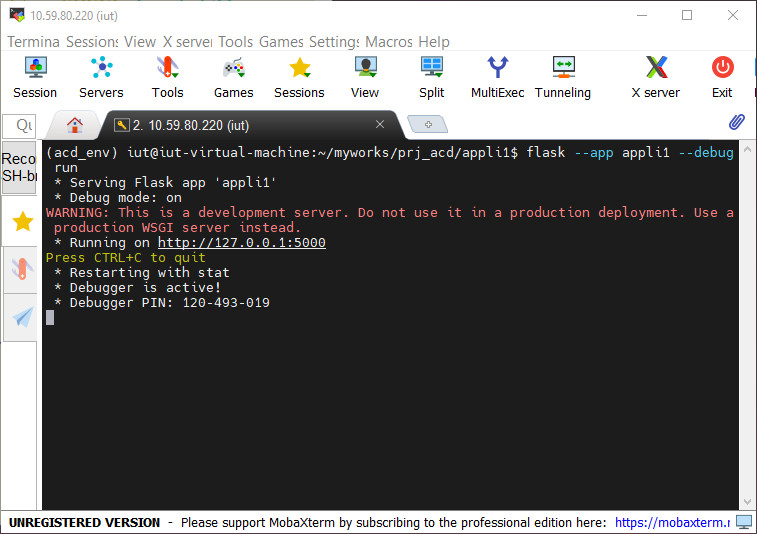

&nbsp;

Le message précise que le débogage est actif et affiche le code PIN de débogage à utiliser comme authentification lors de l'accès à une console python de débogage. Dans ce mode, il n'est pas utile de redémarrer le serveur à chaque modification de l'application, le rechargement est automatique. D'autre part, en cas d'erreur, une page de description de l'erreur est affichée dans le navigateur. 

En cas d'erreur dans l'implémentation du code d'une vue, la réponse à la consultation de la vue concernée provoque l'affichage d'une page d'erreur qui décrit décrit le problème rencontré. 

&nbsp;

> _**Exemple 1**<p>Simuler une erreur d'implémentation dans le code de la vue `profil()` en nommant le second argument `year` au singulier alors que le décorateur déclare un second paramètre `years` au pluriel.</p><p>Le résultat de la requête affiche une page d'information qui trace le fil de propagation de l'erreur en précisant le type d'erreur rencontrée.</p>_

&nbsp;

*Code erroné de la vue `profil()`*

```python
@app.route("/profil/<string:user>/<int:years>")
def  profil(user, year):
    return f"<h2>{user} a une ancienneté de {year} année(s)</h2>"
```

&nbsp;

*fig.7 - Affichage de la page de débogage*

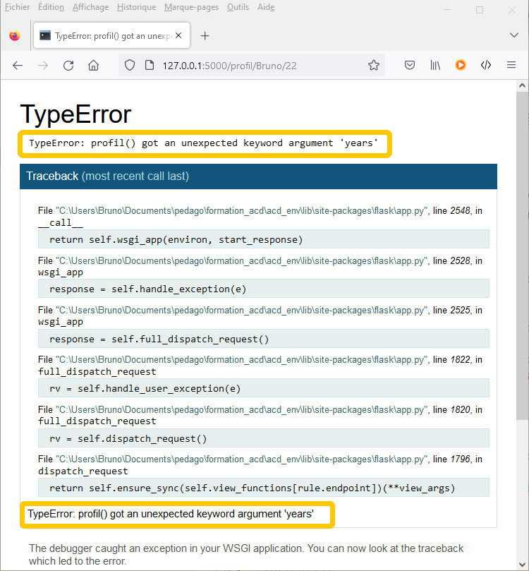

&nbsp;

> _**Exemple 2**<p>On corrige l'erreur précédente dans la déclaration des arguments de la vue, argument `years` au pluriel, mais on oublie de le faire dans son implémentation</p><p>Il est possible de dérouler le code fautif en cliquant sur l'instruction responsable. </p>_

&nbsp;

*Code erroné de la vue `profil()`*

```python
@app.route("/profil/<string:user>/<int:years>")
def  profil(user, years):
    return f"<h2>{user} a une ancienneté de {year} année(s)</h2>"
```

&nbsp;

*fig.8 - 2ème exemple d'affichage de la page de débogage*

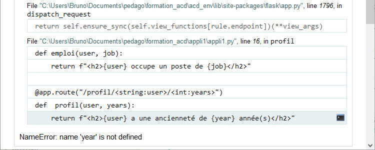


&nbsp;

---

## Structurer une application web Flask

L'organisation la plus simple est basée sur un module unique instanciant l'application avec éventuellement l'utilisation de dossiers particulier pour héberger les modèles HTML ou les fichier statiques.

```bash
./appli1/
├── appli1.py
├── static
│   ├── css
│   │   └── sytles.css
│   └── img
│       └── logo.png
└── templates
    ├── index.html
```

&nbsp;

### **Organiser  le code**

La multiplication des fonctionnalités impose de structurer le code pour une plus grande lisibilité et faciliter la maintenance. La documentation propose des [modèles d'organisations](https://flask.palletsprojects.com/en/2.2.x/patterns/) plus élaborés en séparant le code dans des modules thématiques pour s'appuyer sur les paquets python plutôt que les modules.

&nbsp;

```bash
./packet_name/
├── forms.py
├── __init__.py
├── models.py
├── routes.py
├── static
│   ├── css
│   │   └── styles.css
│   └── img
│       └── logo.png
└── templates
    ├── index.html
    ├── layout.html
    ├── login.html
    └── register.html
```

&nbsp;

> _**Remarque** :<p>Le dossier contenant l'application doit être défini comme un paquet python en ayant à sa racine le module d'initialisation `__init__.py`.</p>_ 

&nbsp;

On crée dans le paquet des modules spécifiques pour définir :
- `routes.py` 🠖 les vues et leurs routes (aussi nommé `views.py`)
- `models.py` 🠖 les classes et les tables pour mapper les éléments des bases de données
- `forms.py` 🠖 Les classes de formulaires avec leurs champs

Le dossier `templates` stocke les fichiers HTML représentant les gabarits HTML.

Le dossier `static` contient les fichiers statiques, eux mêmes organisés dans des sous dossiers thématiques pour les pages de styles, les images, ...

&nbsp;

> _**Exercice** :<p>Nous allons créer un nouveau projet d'application dans un dossier nommé `appli2` dans le répertoire de travail de la formation `prj_acd`. Cette application réprend les mêmes fonctionnalités que l'application `appli1`.</p>_

&nbsp;

```bash
./appli2/
├── __init__.py
├── routes.py
├── static
│   ├── css
│   └── img
└── templates
    ├── index.html
    ├── emploi.html
    └── profil.html
```

&nbsp;

### **Implémentation du module `__init__.py`**

C'est dans ce module que l'on instancie la classe Flask pour créer l'application et les objects liés à d'autres fonctionnalités (accès aux bases de données, système d'authentification). On y déclare également également les propriétés de configuration des différentes technologies mises en oeuvre. La dernière instruction charge le module `routes.py` pour assurer le routage d'URL à la réception d’une requête.

&nbsp;

*Code du module `__init__.py`*

```python
from flask import Flask

app = Flask(__name__)

from appli2 import routes 
```

&nbsp;

### **Implémentation du module `routes.py`**

C’est le fichier qui contient les vues décorées par leur(s) route(s). Il contrôle le fonctionnement de l’application. C'est l'application *Flask* qui reçoit les requêtes HTTP transférées par le serveur WSGI. Pour sélectionner la vue qui doit renvoyer la réponse HTTP à partir de l'URL de la requête, le module doit donc importer l’instance de l’application depuis son paquet pour utiliser ses décorateurs sur les vues. 

L’instruction `return` de la fonction de vue de la route invoque la fonction `render_template()`, qui prend en premier argument le nom complet du *template HTML*, pour retourner la réponse HTML.

&nbsp;

*Code du module `routes.py`*

```python
from flask import render_template
from appli2 import app

@app.route("/")
@app.route("/accueil")
def index():
    return render_template("index.html")

@app.route("/emploi/<user>/<job>")
def emploi(user, job):
    return render_template("user.html", username=user, job=job)

@app.route("/profil/<string:user>/<int:years>")
def  profil(user, years):
    return render_template("profil.html", username=user, years=years)
```

&nbsp;

> **_Import circulaire_** :<p>_Nous venons de faire un import circulaire, ce qui est contraire au préconisation d'usage en informatique (appel du module `routes.py` à l'initialisation du paquet dans `__init__.py`, alors que l'on importe l'application `app` dans ce même module). Le site officiel de **Flask** alerte sur ce point, mais explique que c'est sans conséquence sur le fonctionnement car le module `routes.py` déclare les vue sans les exécuter.</p><p>[https://flask.palletsprojects.com/en/2.2.x/patterns/packages/](https://flask.palletsprojects.com/en/2.2.x/patterns/packages/)</p>_

&nbsp;

### **Implémentation des templates HTML**

Les templates HTML sont des fichiers contenant des données statiques HTML. Ils peuvent  également contenir des  espaces réservés pour insérer les données dynamiques.

L'instruction de lancement est la même que précédement.

&nbsp;

*Code du template HTML `appli2/templates/index.html`*

```html
<!DOCTYPE html>
<html lang="en">
<head>
    <meta charset="UTF-8">
    <title>BUT Info S6</title>
</head>
<body>
    <h1>Bienvenue dans la formation Flask</h1>
</body>
</html>
```

&nbsp;

*fig.12 - Affichage de la page d'accueil*

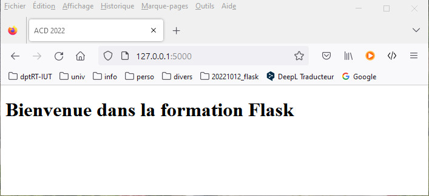

&nbsp;

*Code du template HTML `appli2/templates/emploi.html`*

```html
<!DOCTYPE html>
<html lang="en">
<head>
    <meta charset="UTF-8">
    <title>ACD 2022</title>
</head>
<body>
    <h1>Bienvenue dans la formation Flask</h1>
    <h2>{{ username }} occupe un poste de {{ job }}</h2>
</body>
</html>
```

&nbsp;

*fig.13 - Résultat de la consultation pour l'URL `/emploi/Bruno/formateur`*

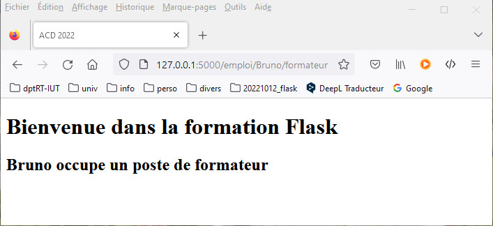

&nbsp;

*Code du template HTML `appli2/templates/profil.html`*

```html
<!DOCTYPE html>
<html lang="en">
<head>
    <meta charset="UTF-8">
    <title>ACD 2022</title>
</head>
<body>
    <h1>Bienvenue dans la formation Flask</h1>
    <h2>{{ username }} a une ancienneté de {{ years }} année(s)</h2>
</body>
</html>
```

&nbsp;

*fig.14 - Résultat de la consultation pour l'URL `/profil/Bruno/22`*

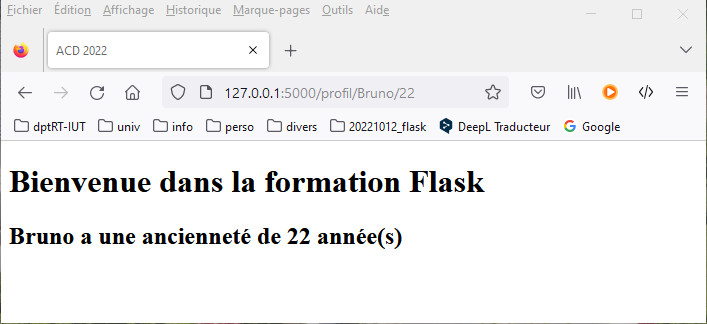

&nbsp;

> _**Remarque**<p>Dans l'onglet du navigateur, on peut repérer pour chaque vue le titre donné à la page dans la balise `title` de l'élément `head`.</p>_

&nbsp;

---
## Alternative avec **Flask Blueprints**

Pour les applications les plus complexes, il est préférable de modulariser en segmentant par fonctionnalité dans des sous-dossiers spécifiques avec leurs propres modules, templates et fichiers statiques. **_Flask Blueprints_** permet de mettre en oeuvre ce type d'organisation en agglomérant des éléments fonctionnels modulaires. Chacun d'eux est représenté par un *Blueprint* spécifique dont la logique est enregistrée dans un sous-dossier qui lui est propre. Le module d'initialisation doit déclarer les *Blueprints*.

> Un *Blueprint* de *Flask* peut être assimilé, dans  une certaine mesure, à une **_application Django_** pour construire un élément modulaire implémentant une fonctionnalité spécifique du site web. 

&nbsp;

[**_Sommaire_** :arrow_heading_up:  ](../README.md)

_[**Template HTML** :fast_forward:](part2_jinja2.md)_
