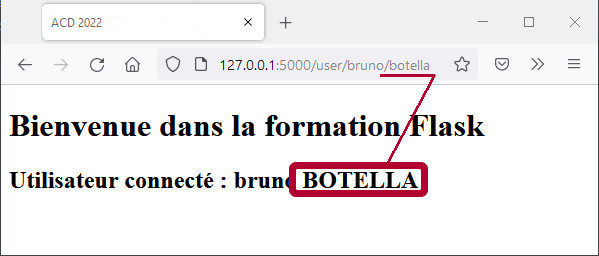
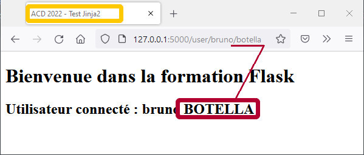
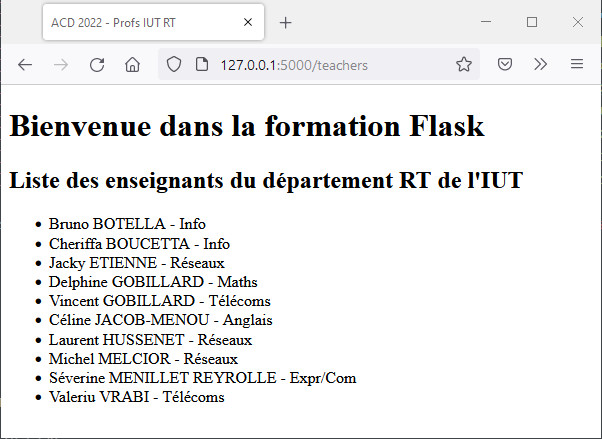
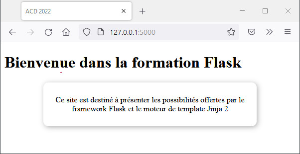

# Utiliser les templates HTML 

## Principe d'utilisation des *template HTML*

Dans une application **_Flask_**, les gabarits des réponses HTML sont stockés dans un dossier nommé `templates`, situé à la racine du paquet de l’application. Ce sont des fichiers textes qui contiennent des éléments HTML et des espaces réservés pour les données dynamiques.

Ils sont appelés dans l’instruction `return` de la fonction vue attachée à la route pour retourner la réponse HTML. L’instruction `return` invoque la fonction `render_template()` qui prend en premier argument le nom complet du **_template HTML_** à utiliser. Les autres paramètres correspondent aux données dynamiques transmises par la vue au gabarit pour les afficher. Ces attributs peuvent être des attributs nommés ou des données regroupées dans le dictionnaire `context` de la fonction.

**Jinja2**  est le moteur de template utilisé par **_Flask_** pour traiter les **_templates HTML_**.

[https://jinja.palletsprojects.com/en/3.1.x/templates/](https://jinja.palletsprojects.com/en/3.1.x/templates/)

Le gabarit utilise des délimiteurs spéciaux (ou balises) placées dans le code HTML aux emplacements prévues pour afficher les données transmises par la vue. 

- `{{ ... }}` → expression qui sera évaluée dans le document final
[https://jinja.palletsprojects.com/en/2.11.x/templates/#list-of-control-structures](https://jinja.palletsprojects.com/en/2.11.x/templates/#list-of-control-structures) 

- `` → déclaration de bloc ou de structure de  contrôle - test conditionnel, boucle
[https://jinja.palletsprojects.com/en/2.11.x/templates/#expressions](https://jinja.palletsprojects.com/en/2.11.x/templates/#expressions)

- `{# ... #}` → commentaires non inclus dans la sortie du modèle
[https://jinja.palletsprojects.com/en/2.11.x/templates/#comments](https://jinja.palletsprojects.com/en/2.11.x/templates/#comments) 

&nbsp;

> Les espaces entre les délimiteurs et le contenu sont recommandés.

&nbsp;

### **Exemple d'utilisation**


> Dans le dossier d'accueil du projet, créez le dossier `appli3` pour faire une application au format paquet python. Son arborescence est donnée ci-après :

&nbsp;


```bash
./appli3/
├── __init__.py
├── routes.py
├── static
│   ├── css
│   └── img
└── templates
    ├── index.html
    └── user.html
```

&nbsp;

*Code du module `__init__`*

```python
from flask import Flask

app = Flask(__name__)

from appli3 import routes 
```
&nbsp;

*Code du module `route.py`*

```python
from flask import render_template
from appli3 import app

@app.route("/")
@app.route("/accueil")
def index():
    return render_template("index.html")

@app.route("/user/<string:firstname>/<string:lastname>")
def getUser(firstname, lastname):
    return render_template("user.html", 
                            firstname=firstname, 
                            lastname=lastname)
```

&nbsp;

*Code du template HTML `index.html`*

```Jinja
<!DOCTYPE html>
<html lang="en">
<head>
    <meta charset="UTF-8">
    <title>ACD 2022</title>
</head>
<body>
    <h1>Bienvenue dans la formation Flask</h1>
</body>
</html>
```

&nbsp;

*Code du template HTML `user.html`*

```Jinja
<!DOCTYPE html>
<html lang="en">
<head>
    <meta charset="UTF-8">
    <title>ACD 2022</title>
</head>
<body>
    <h1>Bienvenue dans la formation Flask</h1>
    <h2>Utilisateur connecté : {{ firstname }} {{ lastname }}</h2>
</body>
</html>
```
&nbsp;

Le **_template_**  récupère les attributs `firtname` et `lastname` et les intègre dans le titre niveau 2 `<h2>`.

&nbsp;

> **_Remarque_** :<p>La route pour afficher l'utilisateur demande deux paramètres. Si il en manque, le serveur répondra par une erreur **404 NotFound**.</p>

&nbsp;

Il est possible d'appliquer des filtres particuliers sur les paramètres transmis avant de les utiliser. Il suffit de l'integrer dans la balise à l'aide d'un pipeline «**|**», on utilise la syntaxe `{{ parameter | filter }}`.

&nbsp;

> **_Exemple_** :<p>_On souhaite afficher le nom de l'utilisateur en majuscule, on utilise le filtre `upper`.</p>_

&nbsp;

*Code modifié du template HTML `user.html` pour utiliser les filtres*

```Jinja
<h2>Utilisateur connecté : {{ firstname }} {{ lastname | upper }}</h2>
```

&nbsp;

*fig.1 - Affichage avec application d'un filtre sur un paramètre*



&nbsp;

### **Liste des filtres disponibles**

[https://jinja.palletsprojects.com/en/3.0.x/templates/#list-of-builtin-filters](https://jinja.palletsprojects.com/en/3.0.x/templates/#list-of-builtin-filters)

| <!-- -->    | <!-- -->    | <!-- -->    | <!-- -->    | <!-- -->    | <!-- -->    |
|-------------|-------------|-------------|-------------|-------------|-------------|
| abs() | float() | lower() | round() | tojson() | attr() |
| forceescape() | map() | safe() | trim() | batch() | format() | max() |
| select() | truncate() | capitalize() | groupby() | min() | selectattr() |
| unique() | center() | indent() | pprint() | slice() | upper() |
| default() | int() | random() | sort() | urlencode() | dictsort() |
| join() | reject() | string() | urlize() | escape() | last() |
| rejectattr() | striptags() | wordcount() | filesizeformat() | length() | replace() |
| sum() | wordwrap() | first() | list() | reverse() | title() |
| xmlattr() |  |  |  |  |  |

&nbsp;

---
## Utiliser un patron de page

Chaque page d’une application web a la même structure HTML de base mais présente un contenu différent. Pour éviter de réécrire cette structure, on définit un gabarit de base que chaque **_template_** de vue utilisera en remplaçant certaines sections spécifiques. C’est l'héritage de modèles de **_Jinja2_**. 

Le gabarit de base contient tous les éléments communs à toutes les pages du site. Il définit les blocs que les gabarits enfants peuvent remplacer. On définit un bloc de code à substituer par une déclaration **_Jinja2_** utilisant le mot clé `block` suivi du nom du bloc et finissant par une déclaration `endblock`.

&nbsp;

*Code du template HTML `/templates/layout.html`*

```Jinja
<!DOCTYPE HTML>
<html>
    <head>
        <meta http-equiv="Content-Type" content="text/html; charset=UTF-8">
        
        <title>ACD 2022 - {{ title }}</title>
        
        <title>ACD 2022</title>
        
         
    </head>
    <body>
        <header></header>
        <section>
            <div id="info" class="zone_info">
             
            </div>
        </section>
        <footer></footer>
   </body>
</html>
```

&nbsp;

Ce **_template_** servira de trame de base à tous les autres. On peut observer la structure conditionnelle utilisée pour l'affichage du titre de l'onglet dans le navigateur. Si la vue transmet un paramètre `title` dans la fonction `render_template`, il sera ajouté au titre par défaut, sinon on affiche le titre par défaut.

Les branchements conditionnelles sont implémentées à l'aide des balises :

- `` → clause conditionnelle à tester, suivie de l'action si `True`
- `` → nouvelle clause conditionnelle si `False`
- `` → action si `False`
- `` → Fin de clause

Dans le corps du document HTML, on déclare un bloc nommé `content`. Il recevra les implémentations réalisées dans les templates enfants qui en hériteront.

```Jinja

```

&nbsp;

---
## Héritage de modèle

Le **_template HTML_** enfant est celui appelé par la route. Pour s'appuyer sur le patron de base, il utilise en première instruction la balise **_Jinja2_** d'héritage avec le nom du gabarit à utiliser `{{ extends "layout.html" }}`. Il faut ensuite définir le contenu des blocks du modèle de base en les déclarant avec le même nom.

&nbsp;

> **_Remarque_**:<p> _Si un bloc est omis, c'est son contenu dans le modèle de base qui sera utilisé.</p>_

&nbsp;

*Code du template HTML `index.html`*

```Jinja


    <h1>Bienvenue dans la formation Flask</h1>

```

&nbsp;

*Code du template HTML `user.html`*

```Jinja


    <h1>Bienvenue dans la formation Flask</h1>
    <h2>Utilisateur connecté : {{ firstname }} {{ lastname | upper }}</h2>

```

&nbsp;

*Code du module `routes.py`*

```python
from flask import render_template
from appli3 import app

@app.route("/")
@app.route("/accueil")
def index():
    return render_template("index.html")

@app.route("/user/<string:firstname>/<string:lastname>")
def getUser(firstname, lastname):
    return render_template("user.html", title="Test Jinja2",
                            firstname=firstname, 
                            lastname=lastname)
```

&nbsp;

*fig.2 - Affichage avec utilisation de l'héritage de template, titre conditionnel et filtre sur un paramètre*



&nbsp;

---
## Boucle itérative dans un *template*

Si la vue transmet une collection en paramètre au *template*, Jinja2 permet de mettre en place une boucle itérative `for ... in` pour scruter chaque élément de la collection et les afficher.

Les boucles itératives sont implémentées à l'aide des balises :

- `` → déclaration de la boucle 
  - `iter` est la variable d'itération
  - `collection` est la collection itérable transmise
- `` → fin de la boucle

&nbsp;

> **_Exemple_** :<p>On va créer une vue qui contient une liste de dictionnaires des enseignants du département RT. La liste est transmise au *template* dans le paramètre `teachers`.</p><p>Le gabarit `teachers.html` étend le modèle de base `layout.html`. Il utilise une boucle sur la liste d’enseignant pour afficher les items `<li> ... </li>` de la liste `<ul>`.</p>

&nbsp;

*Code du template HTML `teachers.html`*

```Jinja


<h1>Bienvenue dans la formation Flask</h1>
<h2>Liste des enseignants du département RT</h2>
<ul>
  
    <li>{{ prof['firstname'] }} {{ prof['lastname'] | upper }} -
        {{prof['domain']}}</li>
  
</ul>

```

&nbsp;

*Code du module `routes.py`*

```python
from flask import render_template
from appli3 import app

@app.route("/")
@app.route("/accueil")
def index():
    return render_template("index.html")

@app.route("/user/<string:firstname>/<string:lastname>")
def getUser(firstname, lastname):
    return render_template("user.html", title="Test Jinja2",
                            firstname=firstname, 
                            lastname=lastname)

@app.route("/teachers")
def getTeachers():
    teachers = [
        {"firstname":"Bruno","lastname":"Botella","domain":"Info"},
        {"firstname":"Cherifa","lastname":"Boucetta","domain":"Info"},
        {"firstname":"Jacky","lastname":"Etienne", "domain":"Réseaux"},
        {"firstname":"Delphine","lastname":"Gobillard","domain":"Maths"},
        {"firstname":"Vincent","lastname":"Gobillard","domain":"Télécoms"},
        {"firstname":"Céline","lastname":"Jacob-Menou","domain": "Anglais"},
        {"firstname":"Laurent","lastname":"Hussenet","domain":"Réseaux"},
        {"firstname":"Michel","lastname":"Melcior", "domain":"Réseaux"},
        {"firstname":"Séverine","lastname":"Menillet Reyrolle","domain":"Expr/Com"},   
        {"firstname":"Valeriu","lastname":"Vrabi", "domain": "Télécoms"}
    ]
    return render_template("teachers.html", title="Profs IUT RT", teachers=teachers)
```

&nbsp;

*fig3. - Affichage avec utilisation d'une boucle itérative*



&nbsp;

---
## Inclure des *templates* - fragments HTML

Une pratique courante consiste à créer un fragment de code HTML pour l'insérer dans une page - bloc de menu, entête ou pied de site, ...

Les fragments sont des *templates* qui intégrent l'ensemble du code HTML qui les caratérise dans un seul fichier. Le fragment est inclut dans un *template HTML* à l'aide de la balise Jinja2 `{% include "fragment.html"}`.

Code du fragment `alert.html`
```Jinja
<div style="box-shadow: 2px 2px 10px #adadad; border-radius:10px;
            width:70%; margin: 0px auto; padding: 10px; 
            text-align:center">
    <p>Ce site est destiné à présenter les possibilités 
       offertes par le framework Flask et le moteur de 
       template Jinja 2</p>    
</div>
```

&nbsp;

*Code du template `index.html` qui charge le fragment `alert.html`*

```Jinja


    <h1>Bienvenue dans la formation Flask</h1>
    

```

&nbsp;

*fig.4 - Affichage avec insertion de fragment*



&nbsp;

[**_Sommaire_** :arrow_heading_up:  ](../README.md)

_[:rewind: **flask**](part1_flask.md) / [_**Requête HTTP** :fast_forward:](part3_HTTP-redirect-error.md)_

