# Gérer les requêtes HTTP - Pages d'erreur et redirection - 

## Génération d'URL

Les URL d'accès aux ressources et aux pages sont au coeur du fonctionnement d'un site web. 

Flask mappe une URL en route d'accès vers une vue à l'aide du décorateur `@app.route()` attaché à l'instance Flask `app` représentant l'application. A l’inverse, la fonction `url_for()` du module `flask` permet de générer une URL à partir d’une fonction vue.

- 1er argument → nom de la fonction vue _**et pas le template HTML ou la route**_
- arguments suivants → paramètres nommés de la fonction

Pour les URL vers les ressources statiques placées dans le dossier `/static` – CSS, scripts, images, …

- 1er argument → dossier `static`
- 2ème argument → attribut nommé `filename` contenant le chemin relatif vers le fichier

La fonction `url_for()` est utilisée dans les **_templates HTML_** pour accéder aux resources de la page, CSS, images, scripts, ... Elle est intégrée comme valeur à l'attribut de l'élément HTML qui fait référence à la ressoure à l'aide d'une **_balise d'expression Jinja_** .


- Ajout d'une page CSS → `<link rel="stylesheet" type="text/css" href="{{ url_for('static', filename='css/mescss.css') }}"/>`
- Ajout d'une image → ``
- lien hypertexte vers une vue →`<a href="{{ url_for('index') }}>Home</a>`

&nbsp;

> _**Exercice**<p>On veut améliorer le design du site en utilisant une page de style. On clone le projet de l'application `appli3` dans une nouvelle application  `appli4` en remplaçant toutes les occurrences à `appli3` par `appli4` dans les différents fichiers. <p></p>Dans l'entête  HTML du Gabarit de base `layout.html`, ajoutez le chargement de la page CSS `css/style.css`.<p></p>On met à disposition la page de style [`styles.css`](/resources/styles.css) utilisée pour le design du site.</p>_

&nbsp;

*Code du template HTML `/templates/layout.html`*

```Jinja
<!DOCTYPE HTML>
<html>
    <head>
        <meta http-equiv="Content-Type" content="text/html; charset=UTF-8">
        
        <title>ACD 2022 - {{ title }}</title>
        
        <title>ACD 2022</title>
        
        <link rel="stylesheet" type="text/css" href="{{ url_for('static', filename='css/styles.css') }}"/>
         
    </head>
    <body>
        <header></header>
        <section>
            <h1>Bienvenue dans la formation Flask</h1>
            <div id="info" class="zone_info">
             
            </div>
        </section>
        <footer></footer>
   </body>
</html>
```

&nbsp;

---
## Gestion des requêtes HTTP

Une requête HTTP est composée d'une entête (*un verbe HTTP, une URI – Uniform Resource Identifier, une version HTTP*) suivie d'une ligne de séparation et d'un corps de requête optionnel, balise <body>...</body>.

&nbsp;

> _**Format d'une URL**<ul><li>**URL standard** → <kbd>`protocole`</kbd>://<kbd>`domain`</kbd>/<kbd>`resource`</kbd>?<kbd>`key1`</kbd>=<kbd>`val1`</kbd>&<kbd>`key2`</kbd>=<kbd>`val2`</kbd></li><li>**URL formée** → <kbd>`protocole`</kbd>://<kbd>`domain`</kbd>/<kbd>`resource`</kbd>/<kbd>`val1`</kbd>/<kbd>`val2`</kbd></li></ul>_   

&nbsp;

Les méthodes des requêtes HTTP implémentées dans **_FLASK_** sont les suivantes :

- **_GET_** → demander la ressource spécifiée
- **_HEAD_** → comme GET sans le corps de la réponse (on a uniquement l'entête)
- **_POST_** → envoyer des données vers la ressource indiquée
- **_PUT_** → remplacer les représentations de la ressource visée
- **_DELETE_** → Supprimer la ressource indiquée
- **_PATCH_** → appliquer des modifications partielles à une ressource

&nbsp;

Une réponse HTTP est composée par une entête (*un verbe HTTP, un code état de la réponse, une explication du code état*) suivie d'une ligne de séparation et d'un corps de requête optionnel.

Les principaux codes de réponses HTTP sont les suivants

- Série **_100_** → information de réponse provisoire
- Série **_200_** → code de succès
  - code **_200_** OK
  - code **_204_** pas de contenu
- Série **_300_** → redirection
  - code **_301_** déplacé de manière permanente 
  - code **_304_** non modifié
- Série **_400_** → erreur client
  - code **_401_** échec d’authentification
  - code **_403_** accès interdit
  - code **_404_** introuvable
- Série **_500_** → erreur serveur
  - code **_503_** server indisponible (surcharge, maintenance, …)

&nbsp;

L'application peut conditionner le déclenchement d'une vue en précisant comme second argument du décorateur de route la liste des méthodes HTTP autorisées sur une URL.

```python
@app.route("/slug_url/", methods=['GET', 'POST'])
```

&nbsp;

> _**Remarque**<p>Si l'argument `methods` est omis, la seule méthode acceptée par défaut est la méthode **GET**.</p>_

&nbsp;

Pour gérer les différentes méthodes HTTP pouvant être reçues, le paquet flask dispose de l'objet `request`, instance de la classe `Request`

[https://tedboy.github.io/flask/generated/generated/flask.Request.html](https://tedboy.github.io/flask/generated/generated/flask.Request.html) 

&nbsp;

### **Traitement des requêtes GET**

Il est possible d'envoyer des données au serveur avec une méthode GET en les ajoutant dans l'URL. Il existe deux manières pour envoyer des paramètres à l'application dans une requête GET

- soit en utilisant une  URL paramétrée formée dîte **_meanningful_**

  ```
  http://127.0.0.1:5000/slug_url/val1/val2
  ```

  Le décorateur de route prévoit l'intégration des paramètres. La vue associée possède les arguments pour les réceptionner. Elle les traite directement et les transmet au **_template HTML_** retourné.

  &nbsp;

  *Extrait du code du module `routes.py`*

  ```python
  @app.route("/test-get/<param1>/<param2>", methods=['GET'])
  def testGet(param1, param2):
    params = {"param1":param1, "param2":param2}
    return render_template("test_GET.html", title="URL formée", params=params)
  ```

&nbsp;
 
- soit en joignant les paramètres à l’URL
  ```
  http://127.0.0.1:5000/slug_url?param1=val1&param2=val2
  ```
  Les paramètres ne sont pas des arguments de la route mais ils sont joins à l'URL au moment de l'envoi. Il faut utiliser l’objet `request` de `flask`, préalablement importé, dans la vue. Les paramètres sont collectés dans son attribut  `args` (dictionnaire). La vue traite les données transmises et les transmet au **_template HTML_** retourné.

  &nbsp;

  *Extrait du code du module `routes.py`*

  ```python
  @app.route("/test-get/")
  def testGetClassic():
      return  render_template('test_GET.html', title="URL + paramètres", params=request.args)
  ```

&nbsp;

> _**Remarque**<p>Les deux propositions communiquent le même paramètre `params`, dictionnaire contenant les données transmises dans l'URL, au template HTML. On peut donc utiliser le même template HTML `test_GET.html` dans les deux cas.</p>_

&nbsp;

*Code du template HTML `test_GET.html`*

```jinja


<h2>Requête GET<br/>Récupération des paramètres</h2>

<ul>
    
    <li>{{ key }} : {{ params.get(key) }}</li>
    
</ul>


```

&nbsp;

*fig.1 - Réponse à une requête avec envoi de paramètres par une URL formée*

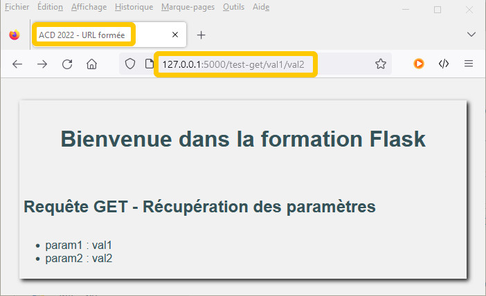

&nbsp;

*fig.2 - Réponse à une requête avec envoi de paramètres par ajout dans l'URL*

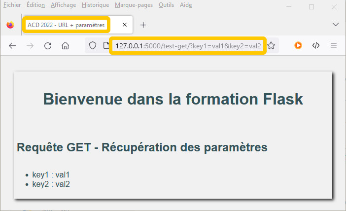

&nbsp;

> _**Remarque**<p>Les limites d'utilisation de la méthode GET pour transmettre des données au serveur vienne de la limite de taille d'une URL qui est de l'ordre de 2048 caractères.</p>_

&nbsp;

### **Traitement des requêtes POST**

La méthode **_HTTP POST_** permet d'envoyer une grande quantité de données au serveur. Elles sont transmises non pas dans l'URL mais dans le corps de la requête. La vue les récupère grâce à l'objet `request`.

Il existe deux méthodes de traitement selon l'origine des données :

- Les données proviennent d’une page formulaire (dialogue avec le visiteur du site)

  Une première vue permet d'envoyer le formulaire de saisie. Il utilise une méthode GET. 
  
  Une seconde vue s'occupe du traitement. Elle n'accepte que les requêtes POST. La vue utilise l’objet l'attribut `form` (dictionnaire des données du formulaire) de l'objet `request` pour récupérer les valeurs saisies.

  &nbsp;

  *Modification du module `routes.py`*
  ```python
  @app.route("/test-form")
  def formPOST():
      return render_template("form_POST.html")

  @app.route("/testFormPOST/", methods=["POST"])
  def testFormPOST():
      return render_template("test_form_POST.html", datas=request.form)
  ```

  &nbsp;

  *Template HTML `form_POST.html`*
  ```jinja
  
  
  <h1>Requête POST<br/>Formulaire d'envoi des données</h1>
  <form action="{{ url_for(testFormPost) }}" method='POST'>
      <p>Data1 : <input type="text" size="10" name="param1"></p>
      <p>Data2 : <input type="text" size="10" name="param2"></p>
      <p>Data3 : <input type="checkbox" name="param3"></p>
      <p><input type="radio" name="param4" value="True" >Vrai<br/>
      <input type="radio" name="param4" value="False">Faux</p>
      <p><input type="submit" value="Envoyer"></p>
  </form>
  
  ```

  &nbsp;

  *fig.3 - Formulaire de saisie*

  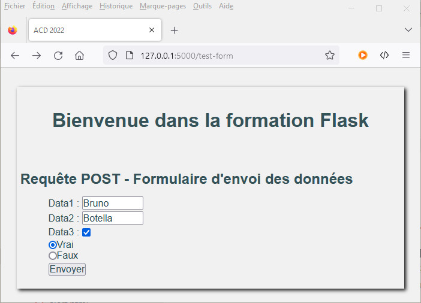

  &nbsp;

  *Template HTML `test_form_POST.html`*

  ```jinja
  
  
  <h1>Requête POST<br/>Récupération des données d'un formulaire</h1>
  <ul>
      
      <li>{{ key }} : {{ datas[key] }}</li>
          
  </ul>
  
  ```

  &nbsp;

  *fig.4 - Réponse suite au traitement du formulaire*

  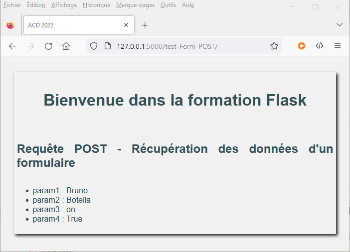

  &nbsp;

- Les données sont des objets JSON transmis hors formulaire (dialogue entre services).
  
  Les données sont envoyées par un client REST (curl, Postman, navigateur avec l'extension <RESTED>, ...). L'entête de requête doit préciser qu'il s'agit d'une application `json` 
  
  >_**Exemple**<p> L'extension **RESTED* est disponible pour la plupart des navigateurs (**Firefox**, **Chrome**, **Safari**, **Edge**, ...). Une fois installé, il permet d'envoyer à un site ou une API des requête HTTP de type **GET**, **POST**, **UPDATE**, **DELETE**, ... </p><p>Pour envoyer des données JSON, il faut </p><ul><li>Sélectionner dans la liste le type de requête **POT** et saisir l'URL de destination</li><li>Dans la section **Headers**, ajouter l'entête HTTP précisant le type de données transmises `Content-Type = "application/json"`</li><li>Dans la section **Request body**, sélectionner dans la liste le type **JSON** et ajouter les données en saisissant pour chacune le nom et la valeur (utiliser le lien **+ Add parmeter** pour en ajouter d'autres)</li><li>Cliquer sur le bouton **Send request** pour envoyer la requête.</li></ul><p>La réponse récupérée est affichée dans la section **Response** en base de page. Elle affiche le code et la réponse HTTP. L'option **Preview permet de visualiser la réponse HTML retournée par le serveur.</p>_

  
  &nbsp;

  *fig.5 - Envoi d'une requête POST depuis un navigateur avec le plugin __RESTED__*

  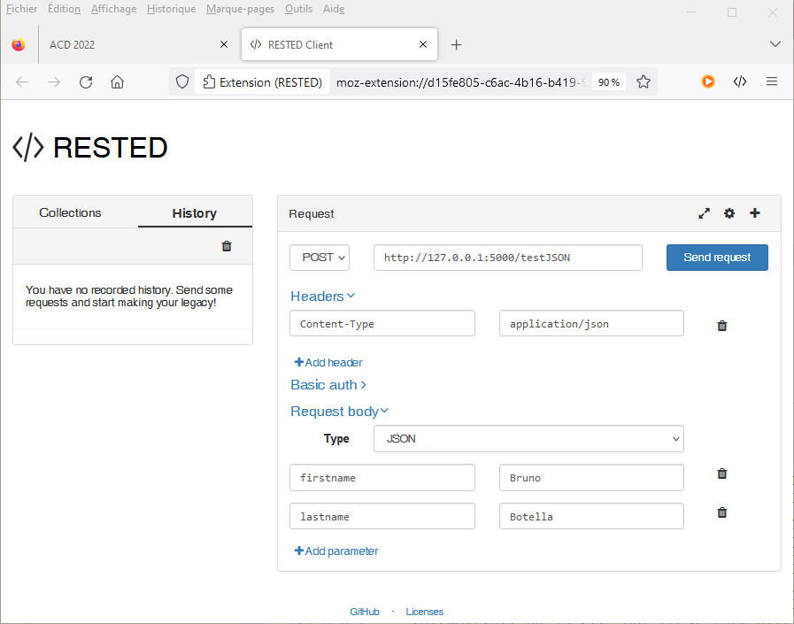

  &nbsp;
  
  La vue utilise  la méthode `get_json()` de l’instance `request` pour récupérer les données afin de les traiter.
  
  &nbsp;

  > _**Remarque**<p>L’objet `request` possède également l’attribut `request.json` qui collecte les données JSON. La méthode `request.get_json()` demeure préférable pour des raisons d’interfaçage avec d’autres extensions **Flask**.</p>_

  &nbsp;

  *Extrait de code du module `routes.html`*

  ```python
  @app.route("/testJSON/", methods=["POST"])
  def testJsonPost():
      return render_template("test_json_POST.html", datas=request.get_json())
  ```

  &nbsp;
  
  *Template HTML `test_form_POST.html`*

  ```jinja
  
  
  <h2>Requête POST - Récupération de données JSON</h2>
  <ul>
      
      <li>{{ key }} : {{ datas[key] }}</li>
          
  </ul>
  
  ```

  &nbsp;
  
  *fig.6 - Réponse POST depuis un navigateur avec le plugin __RESTED__*

  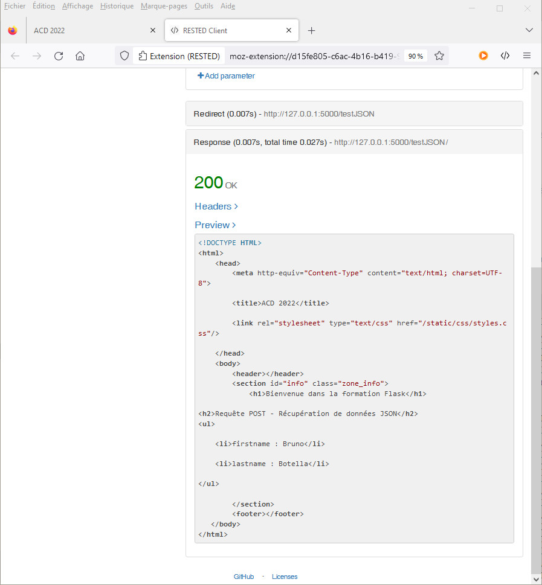

  &nbsp;
  
  *fig.7 - Réponse POST mode **Preview** depuis un navigateur avec le plugin __RESTED__*

  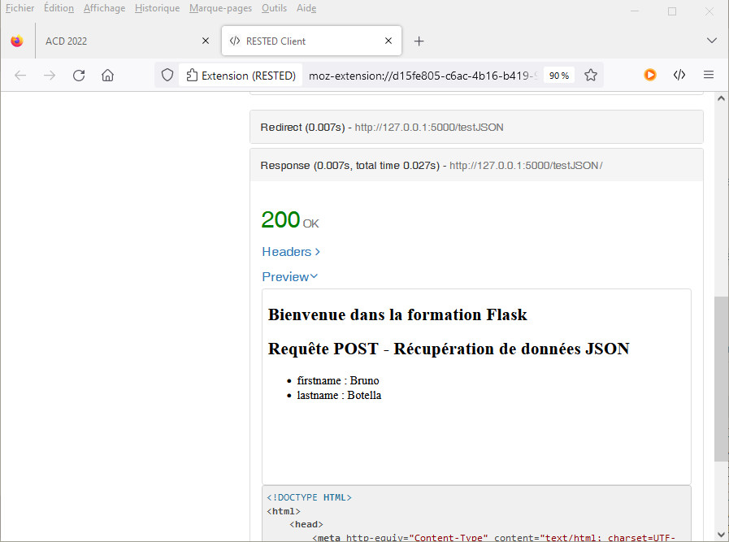


---
## Les pages d’erreurs

Les erreurs sont inhérentes aux applications web

- Interruption d’une requête provoquée par l’utilisateur
- Envoi de données erronées par l’utilisateur
- Requête inconnue ou incomplète de l’utilisateur
- Saturation suite à un grand nombre de requêtes simultanées
- Rupture de communication avec un serveur ressource
- …

Flask gère les erreurs HTTP et affiche une page d’erreur minimaliste par défaut dépendante du *HTTP status code* de l’erreur. L'erreur est enregistrée dans le fichier *logger* de l’application.

Si on lance notre application et qu'on la teste avec une l'URL non traitée par le module `routes.py`, exemple `http://127.0.0.1:5000/testerror`, on obtient la page ci-dessous

&nbsp;

*fig.8 - Erreur 404 par défaut - Page not found*


&nbsp;

IL est possible de personnaliser la gestion des erreurs pour le site en implémentant le module `error_handlers.py` à la racine du paquet de l'application. Il faut importer l’application `app` et les fonctionnalités de  flask nécessaires au fonctionnement.

Il faut déclarer la fonction de traitement de l'erreur avec le décorateur `@app.errorhandler(status_code)` pour capturer l’erreur ayant le même `status_code`. Elle définie le traitement à effectuer et retourne le template HTML associé

&nbsp;

*Code du module `error_handlers.py`*

```python
from flask import render_template
from appli4 import app

@app.errorhandler(400)
def bad_request(error):
    return render_template("error_400.html", title="400_Error")

@app.errorhandler(401)
def unauthorized(error):
    return render_template("error_401.html", title="401_Error")

@app.errorhandler(403)
def forbidden(error):
    return render_template("error_403.html", title="403_Error")

@app.errorhandler(404)
def not_found(error):
    return render_template("error_404.html", title="404_Error")
```

&nbsp;

Il faut importer le module `error_handlers.py` dans le module d’initialisation `__init__.py` comme on l'a fait pour le module `routes.py`.

&nbsp;

*Code du module `__init__.py`*

```python
from flask import Flask

app = Flask(__name__)

from appli4 import routes 
from appli4 import error_handlers
```

&nbsp;

*Code du template HTML `error_404.html`*

```jinja


    <h1>Bienvenue dans la formation Flask</h1>
    <h2>Erreur 404 - La ressource que vous demandez n'est pas disponible</h2>

```

&nbsp;

*Code du template HTML `error_400.html`*

```jinja


    <h1>Bienvenue dans la formation Flask</h1>
    <h2>Erreur 400 - Bad request : la requête n'est pas valide</h2>

```

&nbsp;

*Code du template HTML `error_401.html`*

```jinja


    <h1>Bienvenue dans la formation Flask</h1>
    <h2>Erreur 401 - Non autorisé :La ressource necessite une authentification valide</h2>

```

&nbsp;

*Code du template HTML `error_403.html`*

```jinja


    <h1>Bienvenue dans la formation Flask</h1>
    <h2>Erreur 403 - Forbidden : Accès à la ressource interdit</h2>

```

&nbsp;

*Code du template HTML `error_404.html`*

```jinja


    <h1>Bienvenue dans la formation Flask</h1>
    <h2>Erreur 404 - Not Found : la ressource que vous demandez n'est pas disponible</h2>

```

&nbsp;

> _**Remarque**<p>Il est possible de déclencher volontairement une erreur dans une vue à l'aide de la fonction `abort()` du module `flask`.</p><p>On peut créer la vue `sendError(error_code)` associée à la route `error`, acceptant comme paramètre de l'URL un entier représentant le code statut HTTP de l'erreur déclenchée.</p><p>On teste le fonctionnement du module `error_handlers.py` et de la vue `sendError(error_code)` à partir de l'URL et d'un code d'erreur</p>_

&nbsp;

```python
from flask import abort

@app.route("/error/<int:code>")
def sendError(code):
    abort(code)
```

&nbsp;

*fig.9 - Provoqer une erreur 400 - Bad request*

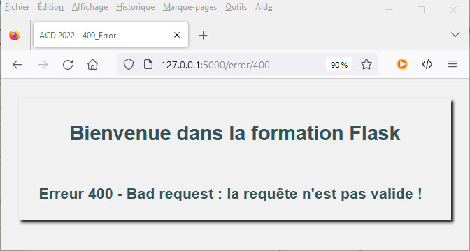

&nbsp;

*fig.10 - Provoqer une erreur 401 - Non Autorisé*

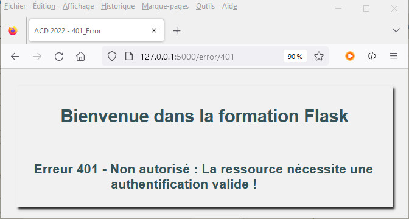

&nbsp;

*fig.11 - Provoqer une erreur 403 - Forbidden*

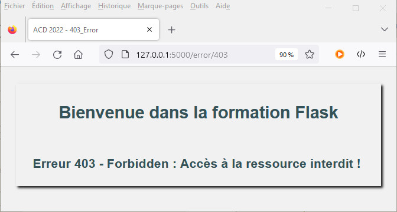

&nbsp;

*fig.12 - Provoqer une erreur 404 - Not found*

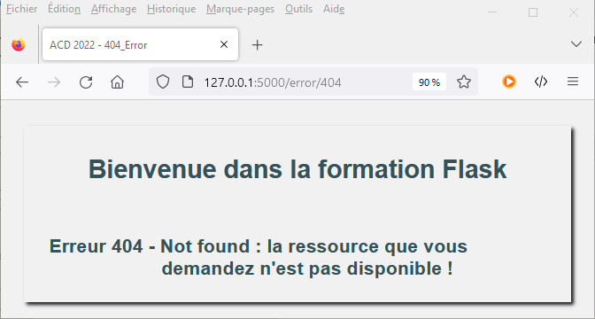

&nbsp;

---
## Les redirections

Lorsque qu'une vue est activée, il est possible de déléguer le traitement de la réponse à une autre vue en lui redirigeant la requête. Pour effectuer une redirection, il faut utiliser la fonction `redirect` du module `flask` dans l'instruction `return` de la vue. On lui passe en argunment l'URL complète de la vue destinataire construite avec `url_for()`.

&nbsp;

> _**Exemple**<p>On crée deux vues, `index()` et `home()`. Lorsque la  vue `home()` est activée par la route `/home`, on redirige le traitement vers la vue `index()`. En testant, avec un navigateur et en inspectant le trafic réseau.</p>_

&nbsp;

*Code du module `routes.py`*

```python
from flask import render_template, redirect, url_for
from appli4 import app

@app.route("/")
@app.route("/accueil")
def index():
    return render_template("index.html")

@app.route("/home/")
def home():
    return redirect(url_for("index"))
```

&nbsp;

*fig.13 - Inspection des échanges de redirection dans l'inspecteur réseau du navigateur*

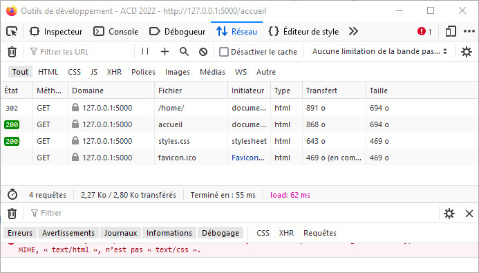

&nbsp;

[**_Sommaire_** :arrow_heading_up:  ](../README.md)

_[:rewind: Template HTML](part2_jinja2.md) / [**_Formulaire HTML_**  :fast_forward: ](part4_forms.md)_
