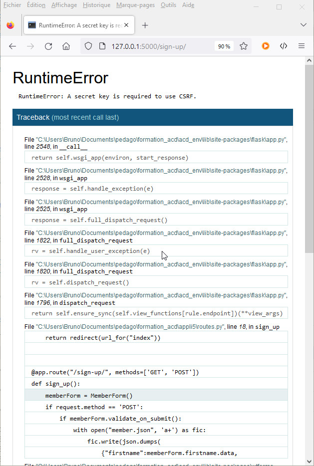
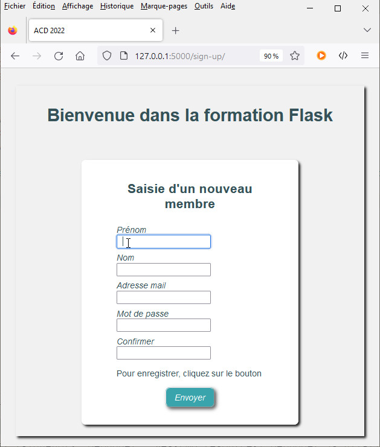
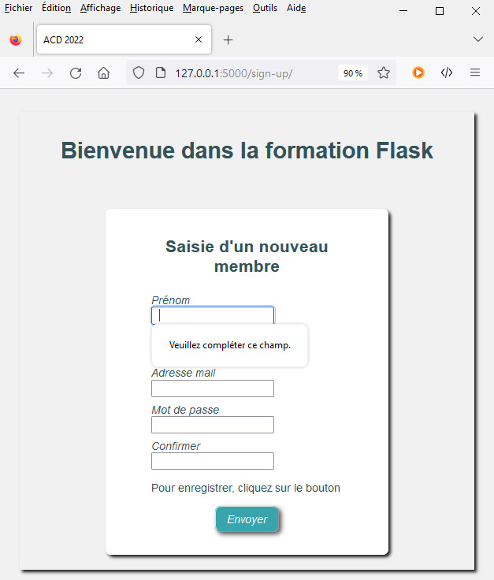
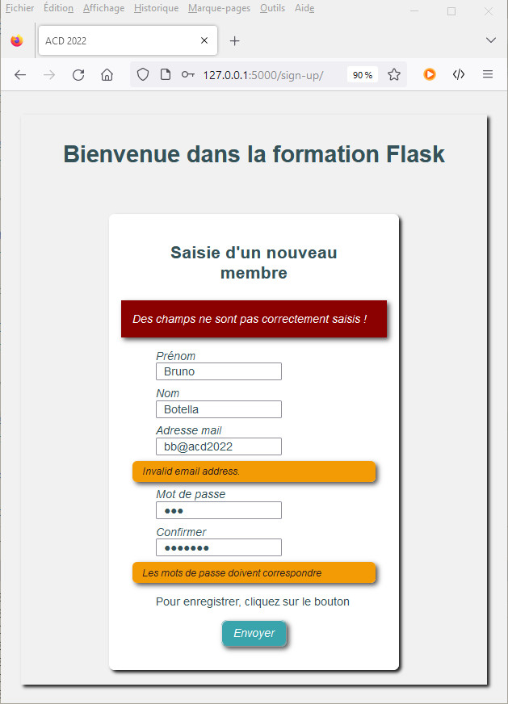

# Utiliser les formulaires - **Utiliser FLASK en BUT RT**

## Présentation de *WTForms* 

[https://wtforms.readthedocs.io/en/3.0.x/](https://wtforms.readthedocs.io/en/3.0.x/)

**_WTForms_** est une bibliothèque d'outils pour la gestion des formulaires et de leurs champs. Elle permet de valider les données saisies pour s'assurer qu'elles soient conformes aux valeurs attendues. Elle permet également de protéger le site contre les attaques CRSF.

Pour l'utiliser, il faut installer l’extension `flask-wtf` dans l'environnement virtuel python. Pour créer un formulaire, on crée dans le module `routes.py` la vue qui affiche le formulaire. 

On crée le module `forms.py` pour y déclarer les classes des formulaires contenant les champs à afficher. Il faut : 

- Importer la classe de base `FlaskForm` depuis `flask_wtf`
- Importer les classes représentant les types des champs de saisie depuis `wtforms`
- Importer les validateurs depuis `wtforms.validate`
- Créer les classes représentant les formulaires de l’application

La classe doit hériter de la classe de base `FlaskForm`. Ses attributs sont des instances des classes de `wtforms` représentant les champs de saisie. Pour chaque champ, le premier argument correspond à son label. Le second est optionnel, il s'agit d'une liste de validateurs qui correspondent aux caractéristiques à respecter pour valider l'entrée de l'utilisateur et afficher optionnellement un message d'erreur personnalisé.

&nbsp;

> Les classes représentant les champs sont accessibles depuis le dossier de l’extension `acd_env/lib/wtforms/fields/` de l'environnement virtuel python. Elles sont déclarées dans les modules `core.py`, `html5.py` et `simple.py` 

&nbsp;

---
## Création d'un formulaire d'adhésion

&nbsp;

> _**Exercice**<p>On veut créer un site qui propose l'enregistrement des utilisateurs qui s'y abonnent. On crée le nouveau projet de l'application `appli5` dans un dossier de même nom.</p><p>On reprend en l'adaptant la structure du site de l'application `appli4`, en particulier la gestion des pages d'erreurs définies par le module `error_handlers.py` et les templates HTML `error_400.html` , `error_401.html` , `error_403.html` , `error_404.html` .</p>_

&nbsp;

```bash
./appli5/
├── __init__.py
├── error_handlers.py
├── forms.py
├── routes.py
├── static
│   ├── css
│   │   └── styles.css
│   └── img
│       └── logo.png
└── templates
    ├── index.html
    ├── layout.html
    ├── alert.html
    ├── error_400.html
    ├── error_401.html
    ├── error_403.html
    ├── error_404.html
    └── sign_up.html
```

&nbsp;

*Code du module `__init__.py`*

```python
from flask import Flask

app = Flask(__name__)

from appli5 import routes 
from appli5 import error_handlers
```
&nbsp;

On ajoute un formulaire à l'application. Les champs du formulaire de saisie sont les suivants :

- Prénom du nouveau membre
- Nom du nouveau membre
- Un mot de passe
- Une confirmation du mot de passe
- Une adresse e-mail valide
- Un bouton de soumission du formulaire

La classe `MemberForm` est créée dans le module `forms.py`.

&nbsp;

*Code du module `forms.py`*

```python
from flask_wtf import FlaskForm
from wtforms import StringField, PasswordField,
from wtforms import EmailField, SubmitField
from wtforms.validators import InputRequired, Email, EqualTo

class MemberForm(FlaskForm):
    firstname = StringField('Prénom', [InputRequired()])
    lastname = StringField('Nom', [InputRequired()])
    mail = EmailField('Adresse mail', [InputRequired(), Email()])
    password = PasswordField('Mot de passe', [InputRequired()])
    confirm = PasswordField('Confirmer ', [EqualTo('password')])
    submit = SubmitField('Envoyer')
```

&nbsp;

Chaque attribut correspond à une instance de la classe représentant le type de champ à créer. Son premier argument correspond au label du champ, le second la liste des validateurs utilisés.

- Le validateur `InputRequired()` impose la saisie d'une valeur pour le champ. 
- Le validateur `EqualTo()` permet de comparer la valeur saisie avec celle d'un autre champ. 
- Le validateur `Email()` contrôle la conformité de la saisie avec la structure d'une adresse mail. 

&nbsp;

> _**Remarque**<p>L'usage du validateur `Email()` impose l'ajout du paquet `email-validator` dans l'environnement virtuel python.</p>_

  &nbsp;

  ```bash
  pip install email-validator
  ```

&nbsp;

On édite le module `routes.py` pour créer la vue `sign_up()` avec sa route. Une pratique courante consiste à utiliser la même vue pour afficher le formulaire et le traiter. La route doit accepter les requêtes **_HTTP GET_** et les requêtes **_HTTP POST_**. Elle commence par instancier la classe de formulaire pour récupérer les champs renseignés. On teste le type de requête *HTTP* reçue à l'aide de l'attribut `method` de l'objet `request` du module `flask`. 

- S'il s'agit une requête **_HTTP POST_**, on est dans le cas de la réception des données saisies. Elles sont récupérées par l'instance du formulaire et stockées dans ses attributs. On les traite puis on redirige vers la page suivante.
- Si c'est une requête **_HTTP GET_**, il s'agit d'une demande d'affichage du formulaire ; on renvoit la page de formulaire pour l'afficher.

&nbsp;

*Code de la fonction de vue `sign_up()` du module `routes.py`*

```python
import json

@app.route("/sign-up/", methods=['GET', 'POST'])
def sign_up():
    memberForm = MemberForm()
    if request.method == 'POST':
        if memberForm.validate_on_submit():
            with open("member.json", 'a+') as fic:
                fic.write(json.dumps(
                    {"firstname":memberForm.firstname.data,
                    "lastname":memberForm.lastname.data,
                    "mail":memberForm.mail.data,
                    "password":memberForm.password.data})
                )
            return redirect(url_for("index"))            
        elif request.method == 'POST':
            flash("Des champs ne sont pas correctement saisis !", 'error')
    return render_template('sign_up.html', form=memberForm)
```

&nbsp;

*Code du template HTML `sign_up.html`*

```jinja


<div  class="login-form"><h1>Saisie d'un nouveau membre</h1>
<form method="POST">
    <p><label for="firstname">Prénom : </label><br/>
        {{ form.firstname }}</p>
    <p><label for="lastname">Nom : </label><br/>
        {{ form.lastname }}</p>
    <p><label for="mail">Adresse mail : </label><br/>
        {{ form.mail }}</p>
    <p><label for="password">Mot de passe : </label><br/>
        {{ form.password }}</p>
    <p><label for="confirm">Confirmer : </label><br/>
        {{ form.confirm }}</p>
<p>Pour enregistrer, cliquez sur le bouton  {{ form.submit }}</p>
</form></div>

```

&nbsp;

*fig.1 - Erreur de configuration - génération d'un clé de signature exigée*



&nbsp;

> **_Remarque_** :<br/>_La protection CSRF liée aux formulaires WTForms impose de créer une clé de signature et de l'enregistrer dans la variable de configuration `SECRET_KEY` de l'application, opération réalisée dans le module d'initialisation `__init__.py`._

&nbsp;

```bash
# Génération d'une clé secrète de signature en python 
python -c 'import secrets; print(secrets.token_hex())'
```
&nbsp;

> **_Exemple de clé générée_**<br/> _`5eed9b976f6d5c80fb8bb74b1bcff9f01218a864d0f2dd76143356d3cc36eda8`_

&nbsp;

*Code du module `__init__.py`*

```python
from flask import Flask

app = Flask(__name__)
app.config["SECRET_KEY"] = b'5eed9b976f6d5c80fb8bb74b1bcff9f01218a864d0f2dd76143356d3cc36eda8'

from . import routes 
from . import error_handlers
```

On modifie également le template HTML `sign_up.html` pour ajouter la protection CSRF au formulaire à l'aide de l'instruction jinja2 `{{ form.csrf_token }}` dans le contenu de la balise `<form>`

&nbsp;

*Code modifié du template HTML `sign_up.html` pour activer la protection CSRF*

```jinja


<div  class="login-form"><h1>Saisie d'un nouveau membre</h1>
<form method="POST">{{ form.csrf_token }}
    <p><label for="firstname">Prénom : </label><br/>
        {{ form.firstname }}</p>
    <p><label for="lastname">Nom : </label><br/>
        {{ form.lastname }}</p>
    <p><label for="mail">Adresse mail : </label><br/>
        {{ form.mail }}</p>
    <p><label for="password">Mot de passe : </label><br/>
        {{ form.password }}</p>
    <p><label for="confirm">Confirmer : </label><br/>
        {{ form.confirm }}</p>
<p>Pour enregistrer, cliquez sur le bouton  {{ form.submit }}</p>
</form></div>

```

&nbsp;

*fig.2 - Formulaire de saisie d'un membre*



&nbsp;

>_**Remarque**<p>L'observation dans le navigateur du code source de la page retournée montre qu'un champ de saisie `type="hidden"` nommé `csrf_token` dont la valeur est cryptée et ajoutée au formulaire.</p>_

&nbsp;

```html
<form method="POST"><input id="csrf_token" name="csrf_token" type="hidden" value="Ijk2ZWExZGJmMTEwYjdlYzQ2NDVkZGUxOGFkNmY3MTQ5MTVjN2I2ZDQi.Y2TmZQ.9Zpx2rFjYAKVa83bqJIphRH2gOM">
```

&nbsp;

Lorsque l'on déplace la souris sur les champs, on peut observer l'action du validateur `InputRequired()` sur les champs qui exigent la saisie d'une valeur. Une étiquette apparaît pour signaler l'obligation de saisie et le formulaire ne pour être soumis tant que les champs ne seront pas renseignés.

&nbsp;

*fig.3 - Obligation de renseignement des champs surveillés par le validateur `InputRequired()`*



&nbsp;

Certains validateurs ne sont activés qu'après envoi de la **_requête POST_** au serveur. La vue récupère les champs dans l'instance du formulaire, elle teste que la requête HTTP utilise bien la méthode **_POST_** et vérifie avec la méthode de l'instance `memberForm.validate_on_submit()` que tous les champs sont conformes aux validateurs déclarés.

- Si tout est validé, la vue traite la saisie puis redirige vers la page d'accueil.
- En cas d'échec, elle teste de nouveau qu'il s'agit bien d'une requête POST pour déclencher avec la fonction `flash` de `flask` un message de **_feedback_** qui ne sera accessible que par la requête suivante, puis disparaîtra. La vue se termine en renvoyant le template HTML de la page de formulaire avec les messages ajoutés en fin de requête. 
  
  Le template HTML est modifié pour surveiller la présence des **_messages flash_** et les afficher.  


&nbsp;

```jinja


<div  class="login-form">
    <h2>Saisie d'un nouveau membre</h2>
    
        
            
                <div class="flash_message">{{ message }}</div>
            
        
    
    <form method="POST">{{ form.csrf_token }}
        <p>{{ form.firstname.label }}<br/>
            {{ form.firstname }}</p>
            
            <div class="flash_error_message">{{ error }}</div>
            
        <p>{{ form.lastname.label }}<br/>
            {{ form.lastname }}</p>
            
            <div class="flash_error_message">{{ error }}</div>
            
        <p>{{ form.mail.label }}<br/>
            {{ form.mail }}</p>
            
            <div class="flash_error_message">{{ error }}</div>
            
        <p>{{ form.password.label }}<br/>
            {{ form.password }}</p>
            
            <div class="flash_error_message">{{ error }}</div>
            
        <p>{{ form.confirm.label }}<br/>
            {{ form.confirm }}</p>
            
            <div class="flash_error_message">{{ error }}</div>
            
        <p class="valid">Pour enregistrer, cliquez sur le bouton  {{ form.submit }}</p>
    </form>
    
</div>

```

&nbsp;

*fig.4 - Erreurs de renseignement du formulaire - renvoi documenté des saisies erronées*



&nbsp;

[**_Sommaire_** :arrow_heading_up:  ](../README.md)

_[:rewind: **Requête HTTP**](part3_HTTP-redirect-error.md) / [**Contextes** :fast_forward:](part5_context.md)_


