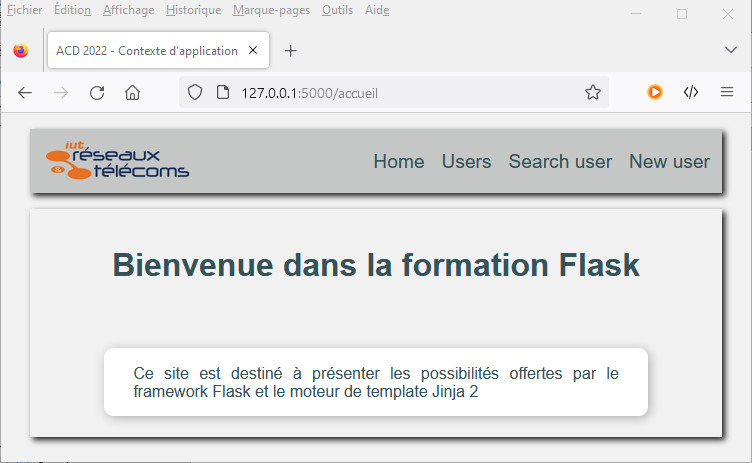
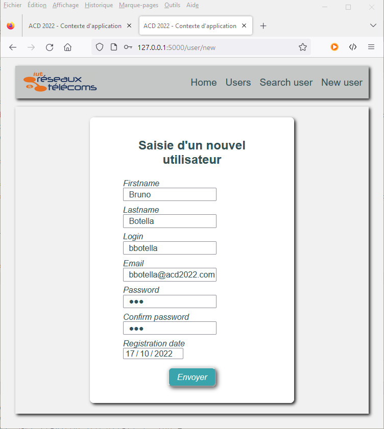
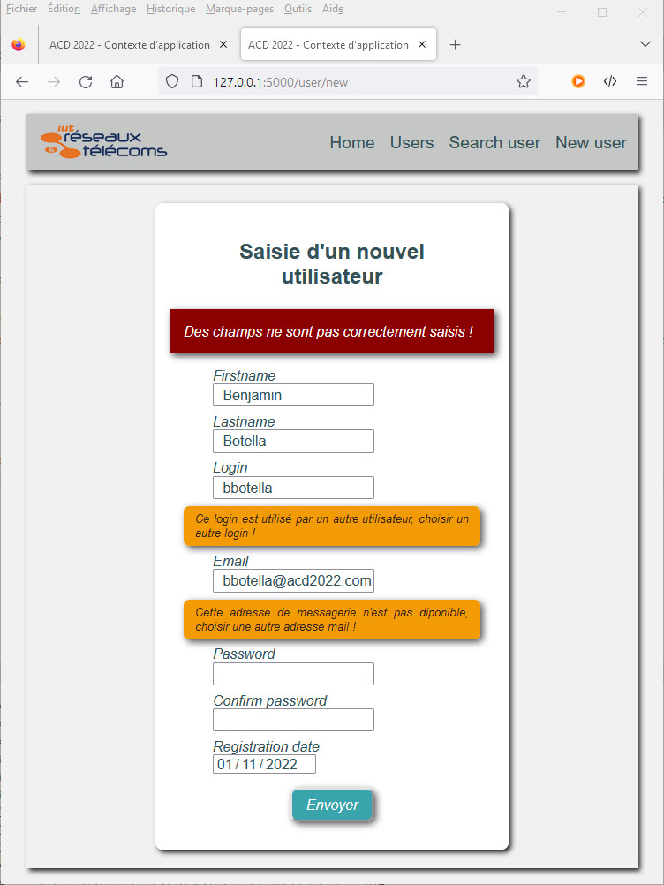
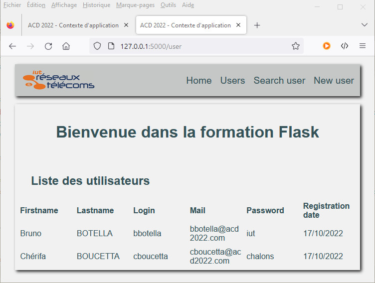
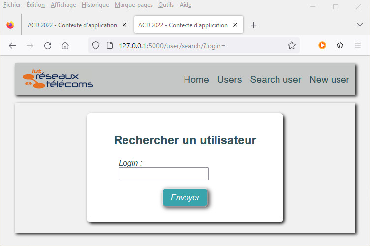
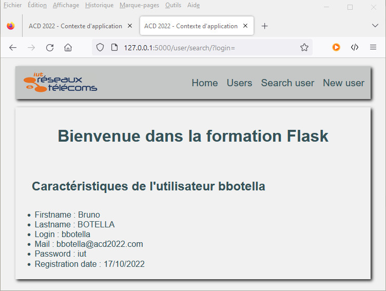
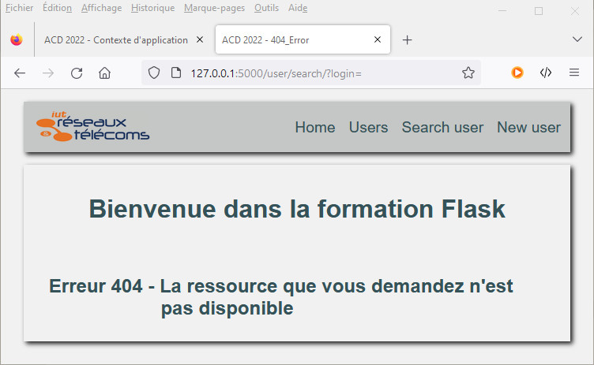

# Contexte de requête  et contexte d’application 

Lors du traitement d'une requête, **_Flask_** pousse un **_contexte de requête_** qui assure le suivi des données au niveau de la requête pendant toute la durée de la demande. Plutôt que de transmettre l'objet de requête aux fonctions qui s'exécutent, les mêmes fonctions accèdent aux **_proxies_** `request` et `session`. 

&nbsp;

> _**Les Proxies**<p>Dans *Flask*, les **proxies** sont des objets qui ciblent d'autres objets. Ils permettent d’accéder à l'application sans réellement l'importer. Ils sont accessibles de manière identique dans chaque thread de travail, mais pointent vers l'objet unique lié à l’application instanciée.</p><p>La référence à l'objet mandaté est nécessaire dans certaines situations, telles que l'envoi de signaux ou la transmission de données à un thread d'arrière-plan.</p>_

&nbsp;

A chaque requête, Flask lance parallèlement un **_contexte de l'application_** qui fait référence à un proxy nommé `current_app` pointant vers l'application. Les fonctions d'affichage, les gestionnaires d'erreurs et les autres fonctions qui s'exécutent pendant une requête ont ainsi accès au proxy `current_app` pour partager les données.

En règle générale, le contexte d'application aura la durée de vie de la requête. Lorsqu’il disparaît, il émet systématiquement le signal `appcontext_tearing_down`, même si une exception est déclenchée. 

En captant ce signal – on parle d’abonnement au signal – on peut exécuter certaines tâches comme par exemple les opérations de sérialisation des données dans un fichier pour assurer leur persistance en cas d’interruption de l’application.

&nbsp;

> _**Remarque**<p>Les signaux sont des notifications émises lorsque des actions se produisent hors de l'infrastructure principale ou dans une extension Flask. Ils permettent d'avertir de l’apparition d’un évènement. La méthode `connect()` d'un signal permet de **s’abonner** à un signal. Le premier argument est la fonction à appeler lorsque le signal est émis, le second argument, facultatif, spécifie un émetteur potentiel. Pour **se désabonner** d'un signal, il suffit d’utiliser sa méthode `disconnect()`.</p><p>**Flask** est livré avec quelques signaux. Le paquet python `blinker` permet de disposer de nombreux signaux supplémentaires qui peuvent être utiles au fonctionnement de l'application. Il faut l’installer dans l’environnement avec la commande ci-après.</p>_

&nbsp;

```bash
pip install blinker
```

&nbsp;

---
## Application aux applications web **Flask**

Si l'application utilise des données spécifiques qu'elle initialise au démarrage, à chaque fois que son processus est arrêté, les modifications apportées sont perdues. Il est nécessaire d'implémenter un mécanisme de sauvegarde des données pour préserver leur état en vue d’un redémarrage ultérieur. On parle de persistance des données.

Les bases de données sont un moyen d'enregistrement efficace des données créées ou modifiées par l'application. Cependant, de simples fichiers enregistrés localement peuvent suffire à satisfaire aux besoins de persistance. Dans ce cas, il faut prévoir un mécanisme de sérialisation pour permettre l'enregistrement des données de l'application.

&nbsp;

> _**Exercice**<p>Nous allons construire une application nommée `appli6` enregistré dans un paquet python de même nom. Elle affiche simplement des utilisateurs caratérisés par leur prénom, leur nom, un nom de login, un mot de passe, une date d'inscription. L'application propose quatre vues, la page d'accueil, la page d'ajout d'un utilisateur, la page d'affichage de tous les utilisateurs, la page de recherche d'un utilisateur particulier.</p><p>L'objectif est d'assurer la persistance des enregistrements des nouveaux utilisateurs. Le contexte d'application permet de surveiller les évènements de lancement et d'arrêt. Plus généralement, un contexte d'application est poussé à chaque contexte de requête, on peut donc implémenter  directement dans le module d'initialisation `__init__.py` qui déclare aussi l'application.</p>_

&nbsp;

> _**Format des données JSON**<p>Un utilisateur est représenté par un dictionnaire python implémentant les clés décrites dans l'exemple ci-après. L'ensemble des utilisateurs sont regroupé dans une liste python nommé `users`.</p>_
  ```json
  {"createdAt": "17/10/2022", "firstname": "Bruno", "lastname": "Botella", "login": "bbotella", "mail": "bb@acd2022.com", "password": "iutchalons"}
  ```

&nbsp;

### **Sérialisation/désérialisation à l'aide du module python `json`**


En Python, les éléments compatibles avec la représentation JSON sont les listes et les dictionnaires dont les clés sont impérativement des chaînes de caractères. Les valeurs sont uniquement des **_chaînes_**, des **_nombres_**, les valeurs `True`, `False` ou `None` (traduit par null en JSON), ou d’autres objets  `list` ou `dict` respectant les mêmes contraintes.

Pour les sérialiser dans un fichier de sauvegarde au format JSON, il faut importer le module `json` de la bibliothèque standard ou celui implémenté dans `flask`. 

- La fonction `dumps()` permet de sérialiser une donnée python passée en premier argument dans une chaîne de caractères au format JSON
- La fonction `dump()` enregistre au format JSON l’objet passé en premier argument dans le fichier passé en second argument.
- La fonction `loads()` permet de désérialiser la chaîne de caractères JSON passée en argument
- La fonction `load()` lit le fichier JSON passé en argument pour retourner son contenu désérialisé.

&nbsp;

### **Initialisation de l'application**

Le module `__init__.py` initialise le paquet de l'application. En plus de l'instance de l'application et de sa variable de configuration `SECRET_KEY` nécessaire au formulaire WTForms, il déclare la liste `users` des utilisateurs enregistrés. Si un fichier de sauvegarde nommé `backup.json` existe, il est utilisé pour initialiser la liste `users`.

> _**Exercice**<p>Pour la sauvegarde des enregistrements, on crée la fonction `save(sender, **extra)`.</p><ul><li>argument `sender` → objet qui est à l’origine du signal qui a déclenché l’action</li><li> argument `**extra` → dictionnaire d’arguments nommés spécifiques.</li></ul><p>Cette fonction enregistre  à l’aide de la fonction `dump()` du module `json` la liste `users` contenant les dictionnaires représentant les utilisateurs dans le fichier `backup.json`. Il faut importer préalablement le module `json` pour l'utiliser.</p><p>On termine en s'abonnant au signal de fermeture du **contexte d’application**, `appcontext_tearing_down` ,  grâce à sa méthode `connect()`. Le premier argument transmis est la fonction `save()` activée, le second l’application `app` qui est à l’origine du signal – voir ci-dessous.</p>_
	
&nbsp;

*Code du module `__init__.py`*

```python
from flask import Flask
from flask import json
from flask import appcontext_tearing_down
from os.path import isfile

app = Flask(__name__)
app.config["SECRET_KEY"] = b'5eed9b976f6d5c80fb8bb74b1bcff9f01218a864d0f2dd76143356d3cc36eda8'

users = []

if isfile("backup.json"):
    with open("backup.json", "r") as fic:
        users = json.load(fic)

def save(sender, **extra):
    
    with open("backup.json", "w") as fic:
        json.dump(users,fic)

appcontext_tearing_down.connect(save,app)

from appli6 import routes 
from appli6 import error_handlers
```

&nbsp;

---
## **Implémentation des vues**

Les vues sont déclarées dans le module `routes.py` de l'application. Il faut importer l'instance `app` depuis le paquet `appli6` de l'application ainsi que la liste des utilisateurs `users`. Il faut également importer les classes et les fonctions nécessaires aux vues déclarées.

&nbsp;

*Début du code du module `routes.py`*

```python
from flask import render_template, redirect, url_for
from flask import request, flash, abort
from appli6 import app, users
from appli6.forms import UserForm
```

&nbsp;

Les templates HTML retournés s'appuient sur le gabarit de base `layout.html`. Il affiche un menu défini dans le fragment `nav.html` - le code est donné ci-après. Il charge la page de styles `styles.css` qui se trouve dans le dossier `static/css/`.

[Cliquer ici pour télécharger la page de style](../ressources/styles.css)

&nbsp;

L'image `logo-rt.png` est affiché dans la barre d'entête avec le menu. Elle doit être placée dans le dossier `static/img`. 

[Cliquer ici pour télécharger le logo](../ressources/logo-rt.png).

&nbsp;

*Code du template HTML `layout.html`*

```jinja
<!DOCTYPE HTML>
<html>
    <head>
        <meta http-equiv="Content-Type" content="text/html; charset=UTF-8">
        
        <title>ACD 2022 - {{ title }}</title>
        
        <title>ACD 2022</title>
        
        <link rel="stylesheet" type="text/css" href="{{ url_for('static', filename='css/styles.css') }}"/>
         
    </head>
    <body>
        <header>
            
            
            
        </header>
        <section id="info" class="zone_info">
         
        </section>
        <footer></footer>
   </body>
</html>
```

&nbsp;

*Code du fragment HTML `nav.html`*

```jinja
<nav>
  <ul>
    <li><a href="{{ url_for('index') }}">Home</a></li>
    <li><a href="{{ url_for('getUsers') }}">Users</a></li>
    <li><a href="{{ url_for('getUserByLogin', login=login) }}">Search user</a></li>
    <li><a href="{{ url_for('setUser') }}">New user</a></li>
  </ul>
</nav>
```

&nbsp;

### **Implémentation de la vue `index()`**

La première vue `index()` affiche la page d'accueil ; elle est activée par l'une des URLs `/`, `/accueil` ou `/home`. Elle retourne le **_template HTML_** associé en lui fournissant comme seul attribut la propriété `title` à utiliser.

&nbsp;

*Code de la vue `index()` du module `routes.py`*

```python
@app.route("/")
@app.route("/accueil")
@app.route("/home")
def index():
    return render_template("index.html", title="Contexte d'application")
```

&nbsp;

*Code du template HTML `index.html`*

```jinja


    <h1>Bienvenue dans la formation Flask</h1>
    

```

&nbsp;

*fig.1 - Page d'accueil*



&nbsp;

### **Implémentation de la vue `setUser()`**

La vue `setUser()` permet d'enregistrer un utilisateur. Elle implémente une instance de la classe `UserForm` déclarée dans le module `forms.py`. Elle hérite de la classe `FlaskForm` du paquet `flask_wtf`. Ses attributs  correspondent aux champs de saisie nécessaires à l'initialisation des propriétés d'un utilisateur. Chaque champ est une instance d'un **_Field_** particulier du module `wtforms` correspondant au type de la propriété associée.

Elle accepte les requêtes **GET** et les requêtes **POST** à partir de la route de l'URL `/user/new`. Elle teste le type de la requête pour déterminer l'opération à effectuer.

- En cas de requête **GET**, elle retourne le formulaire `new_user.html` de création de l'utilisateur. 
- En cas de requête **POST**, elle teste la validité du formulaire à l'aide de la méthode `validate_on_submit()` de l'instance de la classe `UserForm`. Si tout est valide, elle crée un dictionnaire pour chaque propriété de l'utilisateur à partir des données récupérées du formulaire puis l'ajoute à la liste `user`. La réponse est alors redirigée vers la page d'accueil du site. Si la saisie n'est pas valide le formulaire est rechargée avec un **_message flash_** précisant l'erreur de saisie. 

&nbsp;

> _**Remarque**<p>Lors de la saisie d'un utilisateur, il faut s'assurer que le `login` saisi n'est pas déjà utilisé par un autre utilisateur.</p><p>**WTForms** permet de créer nos propres validateurs pour vérifier la conformité de la saisie d'un champ formulaire. Il suffit pour cela de déclarer dans la classe du formulaire une méthode d'instance (premier argument `self`) dont le nom commence impérativement par `validate_` suivi du nom de l'attribut surveillé. Il faut donc créer la méthode de validation `validate_login(self, login)` qui vérifie par scrutation de la liste des utilisateurs que la valeur fournie n'est pas utilisée.</p><p>De la même manière, deux utilisateurs différents ne peuvent avoir la même adresse de messagerie. On implémente donc la méthode `validate_mail(self, mail)` qui vérifie l'absence de l'adresse mail saisie dans les enregistrements existants.</p><p>Le fait de faire ces opérations directement dans la classe formulaire simplifie l'implémentation des vues qui n'ont plus à s'en soucier.</p>_

*Code du module `forms.py`*

```python
from flask_wtf import FlaskForm
from wtforms import StringField, PasswordField
from wtforms import EmailField, SubmitField, DateField
from wtforms.validators import InputRequired, Email, EqualTo, ValidationError
from appli6 import users

class UserForm(FlaskForm):
    firstname = StringField('Firstname', validators=[InputRequired()])
    lastname = StringField('Lastname', validators=[InputRequired()])
    login = StringField('Login', validators=[InputRequired()])
    mail = EmailField('Email', validators=[InputRequired(), Email()])
    password = PasswordField('Password', validators=[InputRequired()])
    confirm_password = PasswordField('Confirm password', validators=[EqualTo('password', message="Les mots de passe doivent correspondre")])
    createdAt = DateField('Registration date', validators=[InputRequired()])
    submit = SubmitField('Envoyer')

    def validate_login(self, login):
        for user in users:
            if user["login"] == login.data:
                raise ValidationError("Ce login est utilisé par un autre utilisateur, choisir un autre login !")


    def validate_mail(self, mail):
        for user in users:
            if user["mail"] == mail.data:
                raise ValidationError("Cette adresse de messagerie n'est pas diponible, choisir une autre adresse mail !")
```

&nbsp;

*Code de la vue `setUser()` du module `routes.py`*

```python
def setUser():
    userForm = UserForm()
    if request.method == 'POST':
        if userForm.validate_on_submit():
            users.append({
                "firstname":userForm.firstname.data,
                "lastname":userForm.lastname.data,
                "login":userForm.login.data,
                "mail":userForm.mail.data,
                "password":userForm.password.data,
                "createdAt":datetime.strftime(userForm.createdAt.data, "%d/%m/%Y")}
            )
            return redirect(url_for("index"))            
        elif request.method == 'POST':
            flash("Des champs ne sont pas correctement saisis !", 'error')
    return render_template('new_user.html', title="Contexte d'application", form=userForm)
```

&nbsp;

*Code du template HTML `new_user.py`*

```jinja


<div  class="login-form">
    <h2>Saisie d'un nouvel utilisateur</h2>
    
    
        
            <div class="flash_message">{{ message }}</div>
        
    
    <form method="POST">{{ form.csrf_token }}
        <p>{{ form.firstname.label }}<br/>
            {{ form.firstname }}</p>
            
            <div class="flash_error_message">{{ error }}</div>
            

        <p>{{ form.lastname.label }}<br/>
            {{ form.lastname }}</p>
            
            <div class="flash_error_message">{{ error }}</div>
            

        <p>{{ form.login.label }}<br/>
            {{ form.login }}</p>
            
            <div class="flash_error_message">{{ error }}</div>
            

        <p>{{ form.mail.label }}<br/>
        {{ form.mail }}</p>
        
        <div class="flash_error_message">{{ error }}</div>
        

        
        <p>{{ form.password.label }}<br/>
            {{ form.password }}</p>
            
            <div class="flash_error_message">{{ error }}</div>
            

        <p>{{ form.confirm_password.label }}<br/>
            {{ form.confirm_password }}</p>
            
            <div class="flash_error_message">{{ error }}</div>
            

            <p>{{ form.createdAt.label }}<br/>
            {{ form.createdAt }}</p>
            
            <div class="flash_error_message">{{ error }}</div>
            

            <p class="valid">{{ form.submit }}</p>
    </form>
    
</div>

```
&nbsp;

*fig.2 - Page du formulaire de création d'un utilisateur*



&nbsp;

*fig.3 - Page du formulaire de création d'un utilisateur invalide (login et mail existants)*



&nbsp;

### **Implémentation de la vue `getUsers()`**

La vue `getUsers()` permet d'afficher dans un tableau HTML les utilisateurs enregistrés. Elle est activée par l'URL `/user` et retourne le template HTML `users.html`. Elle transmet au template HTML la propriété `title`. Elle affecte la liste `users` des utilisateurs au paramètre de même nom qu'elle transmet également au template HTML. 

&nbsp;

*Code de la vue `getUsers()` du module `routes.py`*

```python
@app.route("/user")
def getUsers():
    return render_template("users.html", title="Contexte d'application", users = users)
```

&nbsp;

Le template HTML `users.html` affiche un tableau de six colonnes qui correspondent respectivement aux caractéristiques enregistrées des utilisateurs.

Il définit un bloc **_Jinja2_** pour exécuter une **_boucle for_** sur la liste des utilisateurs `users` transmise par la vue et les insérer ligne par ligne dans le tableau. A chaque itération, on ajoute une expression sur chacune des propriétés du dictionnaire pour afficher la valeur de la clé associée.   

&nbsp;

*Code du template HTML `users.html`*

```jinja


<h1>Bienvenue dans la formation Flask</h1>
<h2>Liste des utilisateurs</h2>
<div id="affiche">
<table>
  <tr>
    <th>Firstname</th>
    <th>Lastname</th>
    <th>Login</th>
    <th>Mail</th>
    <th>Password</th>
    <th>Registration date</th>
  </tr>
  
  <tr>
    <td>{{ user['firstname'] }} </td>
    <td>{{ user['lastname'] | upper }}</td>
    <td>{{ user['login'] }}</td>
    <td>{{ user['mail'] }}</td>
    <td>{{ user['password'] }}</td>
    <td>{{ user['createdAt'] }}</td>
  </tr>
  
</table></div>

```

&nbsp;

*fig.4 - Page d'affichage de la liste des utilisateurs*



&nbsp;

### **Implémentation de la vue `getUserByLogin()`**

La vue `getUserByLogin()` permet d'afficher les caractéristiques d'un utilisateur. Elle accepte les requêtes **GET** et les requêtes **POST**. Elle implémente une instance de la classe `UserForm` transmise au template HTML affichant le formulaire de sélection.

- En cas de requête **GET**, elle retourne template HTML `user_search.html` le formulaire de sélection de l'utilisateur recherché à partir de son `login`. 
- En cas de requête **POST**, elle teste la validité du formulaire, récupère la valeur recherchée puis scrute dans la liste des utilisateurs l'occurrence recherchée. Si elle est trouvée, la vue retourne le template HTML `user.html` en lui transmettant le dictionnaire de l'utilisateur. En cas d'échec, elle renvoie une erreur 404.

&nbsp;

*Code de la vue `getUserByLogin()` du module `routes.py`*

```python
@app.route("/user/search/", methods=["GET", "POST"])
def getUserByLogin():
    userForm = UserForm()
    test = False
    if request.method == 'POST':
        for user in users:
            if user["login"] == userForm.login.data:
                return render_template("user.html", title="Contexte d'application", user = user)

        if test == False:
            abort(404)
    return render_template("user_search.html", title="Contexte d'application", form=userForm)
```

&nbsp;

*Code du template HTML `user_search.html`*

```jinja


<div  class="login-form">
    <h2>Rechercher un utilisateur</h2>
    
    
        
            <div class="flash_message">{{ message }}</div>
        
    
    <form method="POST">{{ form.csrf_token }}
        <p><label for="login">Login : </label><br/>
            {{ form.login }}</p>
        <p>Pour valider, cliquez sur le bouton  {{ form.submit }}</p>
    </form>
    
</div>

```

&nbsp;

*fig.5 - Page du formulaire de sélection d'un utilisateur*



&nbsp;

*Code du template HTML `user.html`*

```jinja


<h1>Bienvenue dans la formation Flask</h1>
<h2>Caractéristiques de l'utilisateur {{ user['login'] }} </h2>
<ul>
  <li>Firstname : {{ user['firstname'] }} </li>
  <li>Lastname : {{ user['lastname'] | upper }}</li>
  <li>Login : {{ user['login'] }}</li>
  <li>Mail : {{ user['mail'] }}</li>
  <li>Password : {{ user['password'] }}</li>
  <li>Registration date : {{ user['createdAt'] }}</li>
</ul>

```

&nbsp;

*fig.6 - Page d'affichage des propriétés d'un utilisateur*



&nbsp;

*Code du module `error_handlers.py`*

```python
from flask import render_template
from appli5 import app

@app.errorhandler(400)
def bad_request(error):
    return render_template("error_400.html", title="400_Error")

@app.errorhandler(401)
def unauthorized(error):
    return render_template("error_401.html", title="401_Error")

@app.errorhandler(403)
def forbidden(error):
    return render_template("error_403.html", title="403_Error")

@app.errorhandler(404)
def not_found(error):
    return render_template("error_404.html", title="404_Error")```
```

&nbsp;

*Code du template HTML `error_404.html`*

```jinja


    <h1>Bienvenue dans la formation Flask</h1>
    <h2>Erreur 404 - La ressource que vous demandez n'est pas disponible</h2>

```

&nbsp;

*fig.7 - Erreur utilisateur non trouvé*



&nbsp;

[**_Sommaire_** :arrow_heading_up:  ](../README.md)

_[:rewind: **Formulaire HTML**](part4_forms.md) / [**Sécurité** :fast_forward:](part6_securite.md)_
