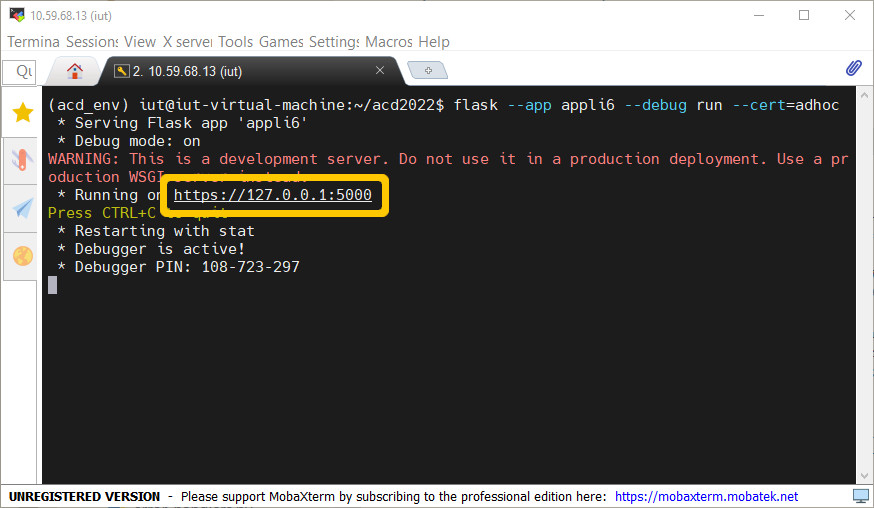
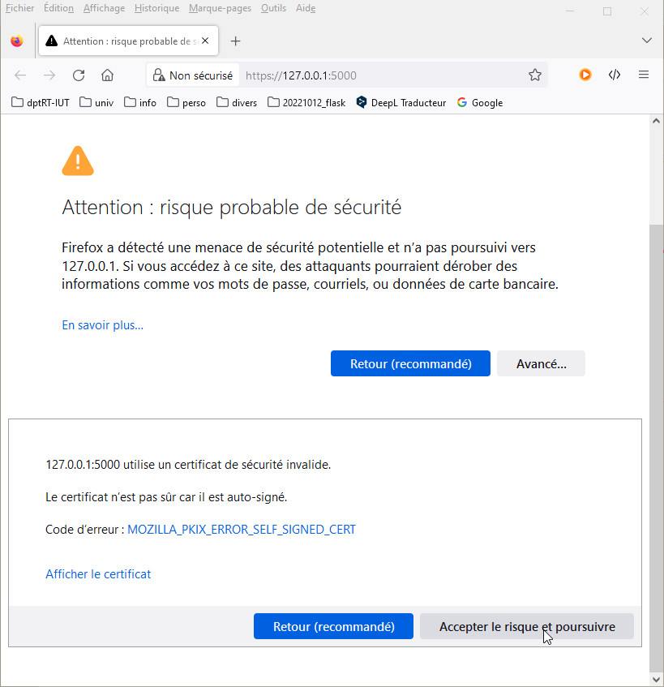
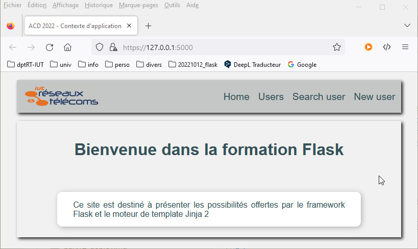
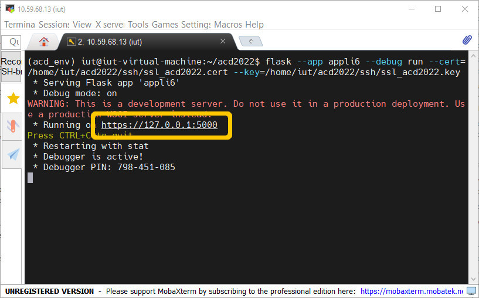
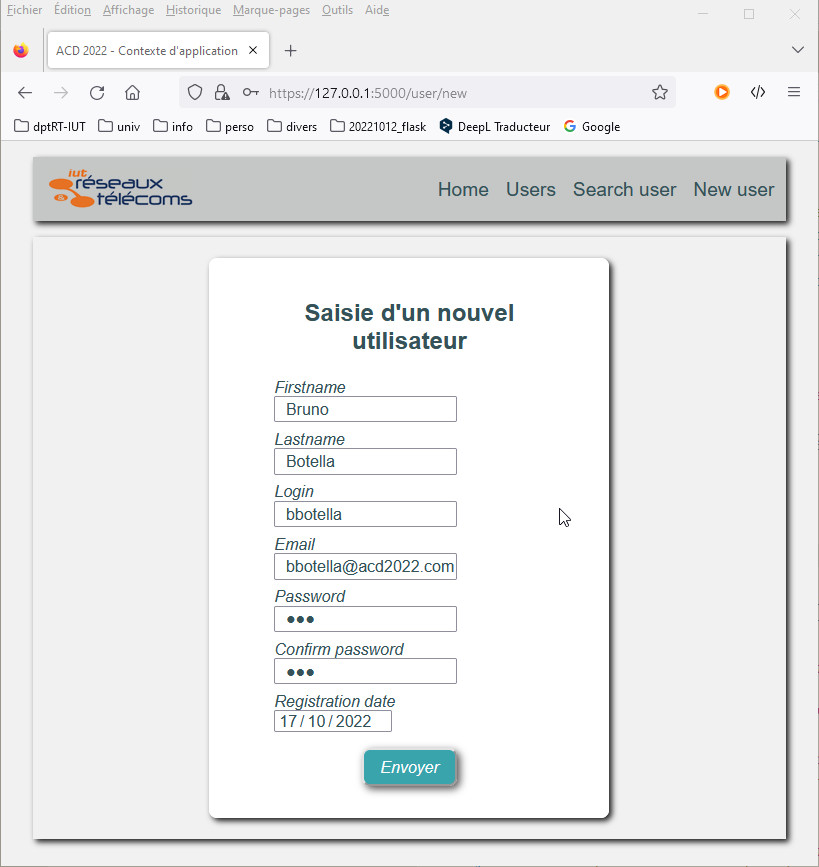
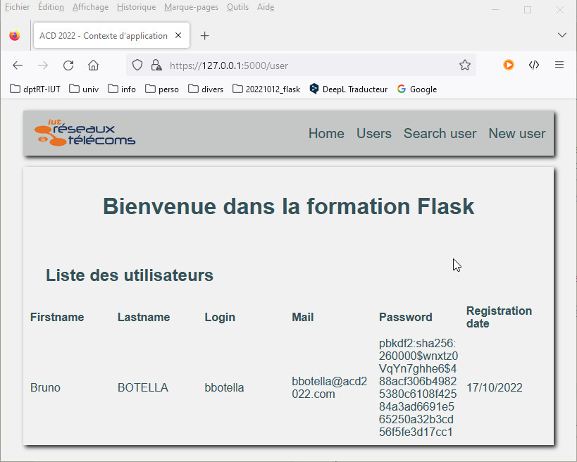
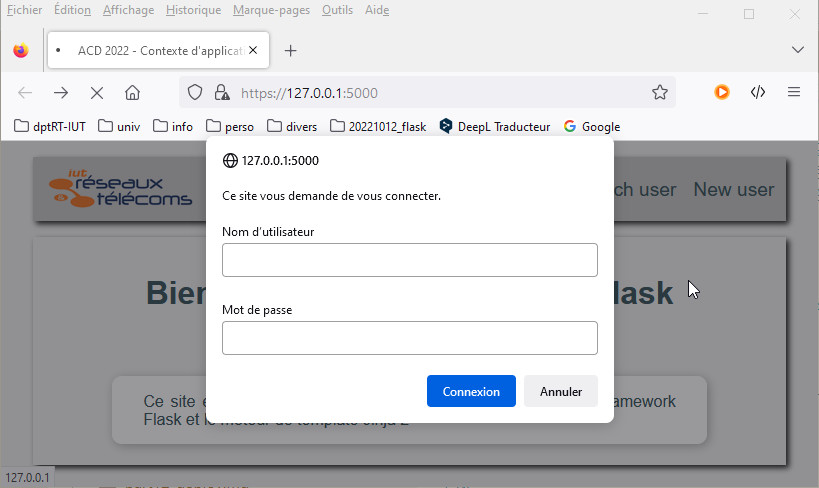

# Sécuriser - **Utiliser FLASK en BUT RT**

## Présentation

&nbsp;

Le site que nous avons construit au chapitre `Contexte de requête et contexte d’application` est entièrement public. Cela signifie qu’il n’y a aucune sécurité d’accès mise en œuvre et que tous les utilisateurs peuvent modifier librement les données. 

Tout d'abord, le site est accessible en **_HTTP_** donc les échanges s'effectuent en clair sur le réseau. Il faut commencer par sécuriser les communications en utilisant le protocole **_HTTPS_**. C'est l'affaire de la configuration du serveur web utilisé pour charger l'application.

D'autre part, les propriétés enregistrées contiennent des mots de passe qui apparaissent en clair et sont donc parfaitement lisibles. Il est nécessaire de sécuriser l'application en cryptant les mots de passe enregistrés.

Enfin, il faut mettre en place un système d’authentification pour controler les autorisations d’accès à certaines fonctionnalités sensibles du site.


&nbsp;

---
## Sécuriser les échanges avec **_HTTPS_**

&nbsp;

> _**Remarque**<p>Le protocole **HTTPS** utilise le protocole **TLS** (**Transport Layer Security**) pour chiffrer et sécuriser les échanges sur le réseau. Lorsque le client tente de se connecter au serveur pour établir une connexion cryptée, le serveur répond en envoyant un **certificat SSL** pour sa propre identification (le certificat contient le nom et le domaine du serveur). Le certificat est signé par une **autorité de certification**. Si le client fait confiance à l'autorité de certification, une fois le certificat accepté, il envoie au serveur une clé de chiffrement qu'il crypte avec la clé publique incluse dans le certificat. Les échanges suivants sont cryptés par cette clé connue seulement du client et du serveur.</p><p style="text-align: right; font-size: small">[https://blog.miguelgrinberg.com/post/running-your-flask-application-over-https](https://blog.miguelgrinberg.com/post/running-your-flask-application-over-https)</p>_


&nbsp;

### **Flask et le protocole HTTPS mode adhoc**

Il est possible d'utiliser le protocole **_HTTPS_** dans le cadre du développement d'une application **_Flask_** pour tester la bonne implémentation du site. Un serveur de développement de **_Flask_** est intégré dans le paquet **_werkzeug_**. Pour utiliser des échanges cryptés avec le serveur de développement de **_Flask_**, une première méthode consiste à le démarrer en mode **_HTTPS adhoc_**. Ce mode impose l'installation de la dépendance `pyopenssl` dans l'environnement virtuel python utilisé.

&nbsp;

```bash
pip install pyopenssl
```

&nbsp;
  
*Commande de lancement du serveur en mode __HTTPS adhoc__*

```bash
flask --app appli6 --debug run --cert=adhoc
```

&nbsp;

*fig.1 - Lancer le serveur de développement en mode __HTTPS adhoc__*



&nbsp;

> _**Exercice**<p>Tester une connexion en **HTTPS** sur le serveur de développement.</p>_

&nbsp;

*fig.2 - Test d'accès __HTTPS__ à l'application web - accepter le certificat*



&nbsp;

*fig.3 - Test d'accès __HTTPS__ à l'application web*



&nbsp;

> _**Exercice**<p>Dans ce mode, **werkzeug** génère un certificat à chaque rechargement du serveur. Ce mode peut s'avérer génant en mode `--debug` car le navigateur redemandera une confirmation d'acceptation du certificat à la requête suivante.</p>_

&nbsp;

### **Flask et le protocole HTTPS avec des certificats auto-signés**

Un second mode d'accès **_HTTPS_** au serveur de débogage consiste à utiliser un certificat auto-signé sur le serveur. Pour cela, il faut créer une clé de signature (ex. `ssl_acd2022.key`) à l'aide de la commande `genrsa` du paquet linux `openssl`. On génère alors le certificat (ex. `ssl_acd2022.cert`) et on utilise la clé pour le signer.

```bash
# Generate ssl key
openssl genrsa 4048 > ssl_acd2022.key

# Generate certificate file signed by the ssl key
openssl req -new -x509 -nodes -sha1 -days 3650 -key ssl_acd2022.key > ssl_acd2022.cert
```

&nbsp;

*Commande de lancement du serveur de développement en mode __HTTPS self-signed__*

```bash
flask --app appli6 --debug run --cert=/home/iut/acd2022/ssh/ssl_acd2022.cert --key=/home/iut/acd2022/ssh/ssl_acd2022.key 
```

&nbsp;

*fig.4 - Lancer le serveur de développement en mode __HTTPS__ avec un certificat auto-signé*



&nbsp;

---
## Crypter les mots de passe des utilisateurs

&nbsp;

> _**Exercice**<p>Nous allons faire une copie du paquet `appli6` précédent dans le paquet `appli7`. Il faut penser à remplacer dans tous les modules les occurrences à **appli6**  par **appli7**.</p>_


&nbsp;

*Code du module `__init__.py`*

```python
from flask import Flask, json, appcontext_tearing_down
from os.path import isfile

app = Flask(__name__)
app.config["SECRET_KEY"] = b'5eed9b976f6d5c80fb8bb74b1bcff9f01218a864d0f2dd76143356d3cc36eda8'

users = []

if isfile("backup.json"):
    with open("backup.json", "r") as fic:
        users = json.load(fic)

def save(sender, **extra):
    
    with open("backup.json", "w") as fic:
        json.dump(users,fic)

appcontext_tearing_down.connect(save,app)

from appli7 import routes 
from appli7 import error_handlers
```

&nbsp;

Nous allons modifier la vue `setUser()` de saisie d'un utilisateur dans le module `routes.py` pour crypter le mot de passe avant de l'enregistrer. Il faut préalablement importer dans ce module la fonction  `generate_password_hash` du module `werkzeug.security.py`.

- Premier argument → la chaîne de caractères représentant le mot de passe en clair 
- Second argument → attribut nommé `method` représentant la méthode de hachage utilisée  (valeur par defaut `pbkdf2:sha256`)

&nbsp;

*Code de la vue `setUser()` du module `routes.py`*

```python
from werkzeug.security import generate_password_hash, check_password_hash

@app.route("/user/new", methods=["GET", "POST"])
def setUser():
    userForm = UserForm()
    if request.method == 'POST':
        if userForm.validate_on_submit():
            users.append({
                "firstname":userForm.firstname.data,
                "lastname":userForm.lastname.data,
                "login":userForm.login.data,
                "mail":userForm.mail.data,
                "password":generate_password_hash(userForm.password.data, method="pbkdf2:sha256"),
                "createdAt":userForm.createdAt.data}
            )
            return redirect(url_for("index"))            
        elif request.method == 'POST':
            flash("Des champs ne sont pas correctement saisis !", 'error')
    return render_template('new_user.html', title="Appli5", form=userForm)
```

&nbsp;

> _Pour les besoins de l'exercice, on s'assure qu'aucun enregistre avec des mot de passe en clair n'existe. On supprime le fichier `backup.json` avant de lancer l'application. A l'envoi d'une requête de saisie d'un utilisateur, le contexte d'application est poussé par le contexte de requête. A la fin de la requête, il est fermé et déclenche la sauvegarde de la liste `users` dans le fichier `backup.json` avec le nouvel utilisateur. En le consultant, on observe l'enregistrement crypté du mot de passe._

&nbsp;

*Commande de lancement du serveur de développement sur l'application en mode __HTTPS self-signed__*

```bash
flask --app appli7 --debug run --cert=/home/iut/acd2022/ssh/ssl_acd2022.cert --key=/home/iut/acd2022/ssh/ssl_acd2022.key 
```

&nbsp;

*fig.5 - Formulaire de saisie d'un utilisateur*



&nbsp;

*Contenu du fichier `backup.json`*

```json
[{"createdAt": "17/10/2022", "firstname": "Bruno", "lastname": "Botella", "login": "bbotella", "mail": "bbotella@acd2022.com", "password": "pbkdf2:sha256:260000$wnxtz0VqYn7ghhe6$488acf306b49825380c6108f42584a3ad6691e565250a32b3cd56f5fe3d17cc1"}]
 ```

&nbsp;

*fig.6 - Consultation des utilisateurs*



---
## Authentification

&nbsp;

Pour implémenter un système d'authentification, le protocole HTTP propose plusieurs modes d’authentification :

- Le premier est l'**_authentification d’accès de base_**. Il s’appuie sur la transmission au serveur d’un identifiant et d'un mot de passe et utilise le codage **_Base64_**.

- Le second est l'**_authentification d’accès digest_**. Il consiste à appliquer une fonction de hachage à l’identifiant et au mot de passe avant de les transmettre.

- Le troisième est l'**_authentification par jeton_**. Elle applique une fonction de hachage à l’identifiant et au mot de passe avant de les transmettre.

&nbsp;

Nous étudierons ici l'authentification de base. L'authentification par jeton sera étudiée avec les sessions et les cookies.

&nbsp;

> _**Remarque**<p>L'objet `request` du paquet `flask` possède l'attribut `authorization` qui contient les données d'authentification transmise dans l'entête **HTTP** de la requête utilisant l'**authentification HTTP de base**.</p><p>Deux données sont présentes, le nom d'utilisateur `request.authorization.username` et le mot de passe `request.authorization.password`.</p>_

&nbsp;

### **Décorateur d'authentification**

> _**Notion de décorateur de fonction**<p>Utiliser un décorateur sur une fonction permet à modifier le comporte d'une fonction en l'adaptant au besoin de l'application. Il consiste à envelopper à l'aide de l'opérateur `@` la fonction décorée dans une fonction décoratrice (syntaxe `@decorator_name_function`).</p><p>la fonction décoratrice ne prend qu'un seul argument, la fonction décorée. Elle déclare une fonction interne qui effectue le traitement complémentaire modifiant le comportement de la fonction décorée et retourne le résultat. Cette fonction interne est nommé **wrapper** car il enveloppe l'exécution de la fonction décorée.</p><p>Le **wrapper** dispose de deux arguments <ul><li>`*args` → liste des **arguments sans nom** provenant de la fonction décorée</li><li>`**kwargs` → dictionnaire des **arguments nommés** provenant de la fonction décorée</li></ul></p><p>Pour remplacer de manière plus efficace et ressemblante, le décorateur doit être entièrement identifié comme étant la fonction décoré, hors les attributs spéciaux comme `__name__` ou `__doc__` sont spécifiques à chaque fonction. Python met à disposition le décorateur `wraps` du paquet `functools` qui permet de réaffecter les attribut spéciaux de la fonction décorée à la fonction décoratrice. On l'utilise donc sur la fonction interne **wrapper**</p><p>Au final, le décorateur retourne la fonction **wrapper** enveloppant la fonction décorée.</p>_

&nbsp;

Pour mettre en place une authentification, il faut de créer un décorateur qui sera appliqué sur les vues qui demandent une autorisation d'accès. Pour cela, il faut importer la fonction `wraps` du module `functools` pour l'utiliser comme décorateur `@wraps` de la fonction **_wrapper_** du décorateur construit. Il permet de préserver l'identité de la fonction d'origine qui est enveloppé par le décorateur créé. 

On déclare comme **_wrapper_** la fonction interne  `decorated(*args, **kwargs)` pour la forme car elle sera identifiée par les attributs de la fonction décorée. Dans notre application, elle doit vérifier que les paramètres d'authentification HTTP ont été transmis. Dans ce cas, elle vérifie qu'il correspondent à un utilisateur existant dans la liste `users` pour renvoyer la vue décorée.
En cas d'échec, elle renvoie simplement un message d'erreur avec le code HTTP 401 correspondant à une erreur d'authentification. 

Les mots de passe enregistrés des utilisateurs de la liste `users` sont cryptés. Le paquet `werkzeug.security`, propose la fonction `check_password_hash(hash_code, pass_string)` pour vérifier l'exactitude d'un mot de passe.

- Premier argument → une chaîne de caratères hâchée correspondant au mot de passe crypté de référence 
- Second argument → la chaîne de caractères représentant le mot de passe en clair à vérifier

voir la page [https://werkzeug.palletsprojects.com/en/2.2.x/utils/#module-werkzeug.security](https://werkzeug.palletsprojects.com/en/2.2.x/utils/#module-werkzeug.security)


&nbsp;

*Code du décorateur `auth_required(fct)` du module `routes.py`*

```python
from flask import make_response
from werkzeug.security import check_password_hash
from functools import wraps
from appli7 import app, users


def auth_required(fct):
    @wraps(fct)
    def decorated(*args, **kwargs):
        auth = request.authorization
        if auth:
            for user in users:
                if user["login"] == auth.username:
                    if check_password_hash(user["password"], auth.password):
                        return fct(*args, **kwargs)
        return make_response("Echec d'authentification !", 401, {"WWW-Authenticate": "Basic realm='Login Required !'"})
    return decorated

```
&nbsp;

Il suffit à présent de décorer les vues qui nécessite une authentificationavec cette fonction . On protègera les vues `getUsers()` et `getUserByLogin()`.

&nbsp;

*Code complet du module `routes.py`*

```python
from datetime import datetime
from flask import render_template, redirect, url_for, request, flash, abort, make_response
from werkzeug.security import generate_password_hash, check_password_hash
from appli7 import app, users
from appli7.forms import UserForm
from functools import wraps


def auth_required(fct):
    @wraps(fct)
    def decorated(*args, **kwargs):
        auth = request.authorization
        if auth:
            for user in users:
                if user["login"] == auth.username:
                    if check_password_hash(user["password"], auth.password):
                        return fct(*args, **kwargs)
        return make_response("Echec d'authentification !", 401, {"WWW-Authenticate": "Basic realm='Login Required !'"})
    return decorated

@app.route("/")
@app.route("/accueil")
@app.route("/home")
def index():
    return render_template("index.html", title="Contexte d'application")

@app.route("/user")
@auth_required
def getUsers():
    return render_template("users.html", title="Contexte d'application", users = users)

@app.route("/user/search/", methods=["GET", "POST"])
@auth_required
def getUserByLogin():
    userForm = UserForm()
    test = False
    if request.method == 'POST':
        for user in users:
            if user["login"] == userForm.login.data:
                return render_template("user.html", title="Contexte d'application", user = user)
        if test == False:
            abort(404)
    return render_template("user_search.html", title="Contexte d'application", form=userForm)

@app.route("/user/new", methods=["GET", "POST"])
def setUser():
    userForm = UserForm()
    if request.method == 'POST':
        if userForm.validate_on_submit():
            users.append({
                "firstname":userForm.firstname.data,
                "lastname":userForm.lastname.data,
                "login":userForm.login.data,
                "mail":userForm.mail.data,
                "password":generate_password_hash(userForm.password.data, method="pbkdf2:sha256"),
                "createdAt":datetime.strftime(userForm.createdAt.data, "%d/%m/%Y")}
            )
            return redirect(url_for("index"))            
        elif request.method == 'POST':
            flash("Des champs ne sont pas correctement saisis !", 'error')
    return render_template('new_user.html', title="Contexte d'application", form=userForm)
```

*fig.7 - Consultation des utilisateurs - demande d'authentification*



&nbsp;

[**_Sommaire_** :arrow_heading_up:  ](../README.md)

_[:rewind: **Contexte**](part5_context.md) / [**Session - cookie** :fast_forward:](part7_session-cookie.md)_