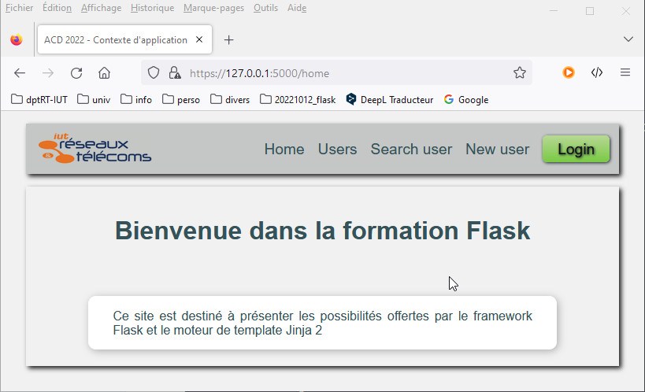
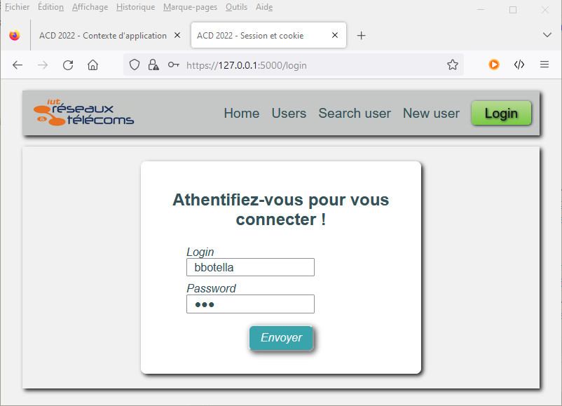
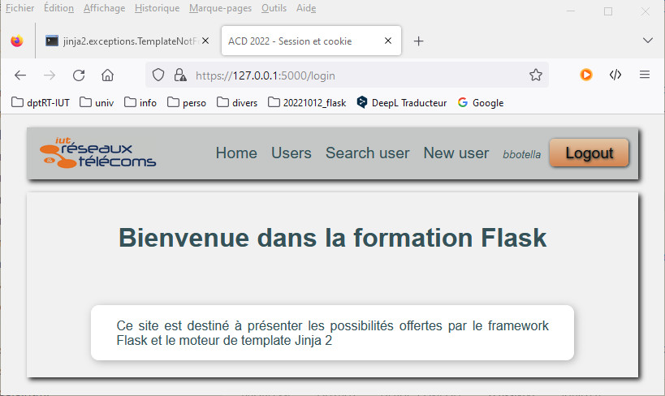
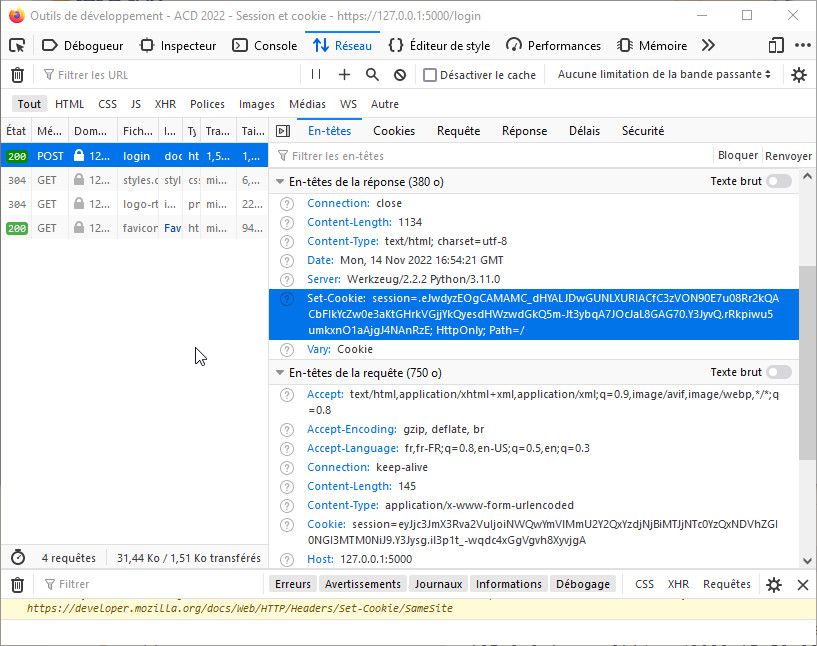
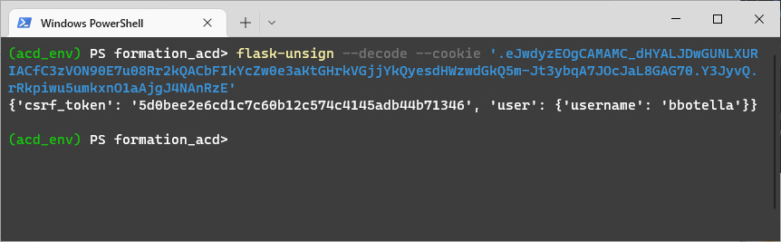
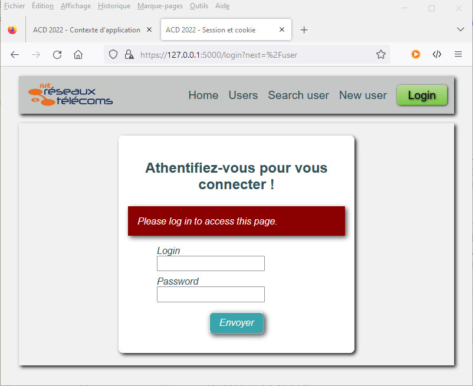

# Gérer les sessions et les cookies - **Utiliser FLASK en BUT RT**

## Les sessions avec Flask

Flask gère les sessions du coté client dans un cookie de session. Dans Flask, les cookies sont signés pour les protéger d'éventuelles modifications. Comme pour la protection apportée à **_WTForms_**, il faut générer une clé de signature enregistrée dans la **_config_** de l’application déclarée dans le module `__init__.py` (clé généralement commune à toutes les fonctionnalités activées nécessitant une signature). On rappelle la commande python de génération d'une clé secrète utilisant la fonction `token_hex()` du module `secrets`.  

```bash
# Génération de la clé secrète de signature
python -c 'import secrets; print(secrets.token_hex())'
```

&nbsp;

> _**Exercice**<p> On souhaite modifier notre application de gestion d'utilisateurs en remplaçant l'authentification de base HTTP par l'ajout dans la barre de menu de l'entête de boutons `Login/Logout`. Le menu affiche conditionnellement l'un des boutons et le lien de **connexion/déconnexion** asocié ainsi que l'identifiant de l'utilisateur.</p>Nous allons faire une copie du paquet `appli7` précédent dans le paquet `appli8`. Il faut penser à remplacer dans tous les modules les occurrences à **appli7**  par **appli8**.</p>_

&nbsp;

*Code du module `__init__.py`*

```python
from flask import Flask, json, appcontext_tearing_down
from os.path import isfile

app = Flask(__name__)
app.config["SECRET_KEY"] = b'5eed9b976f6d5c80fb8bb74b1bcff9f01218a864d0f2dd76143356d3cc36eda8'

users = []

if isfile("backup.json"):
    with open("backup.json", "r") as fic:
        users = json.load(fic)

def save(sender, **extra):
    
    with open("backup.json", "w") as fic:
        json.dump(users,fic)

appcontext_tearing_down.connect(save,app)

from appli8 import routes 
from appli8 import error_handlers
```

&nbsp;

On modifie le fragment de template HTML `nav.html` pour lui ajouter de manière conditionnelle le bouton de connexion **_Login_** ou le bouton de déconnexion **_Logout_** selon que la session soit respectivement fermée ou ouverte à l'aide d'un block conditionnel **_Jinja2_**. 

&nbsp;

*Code du template HTML `nav.html`*

```jinja
<nav>
  <ul>
    <li><a href="{{ url_for('index') }}">Home</a></li>
    <li><a href="{{ url_for('getUsers') }}">Users</a></li>
    <li><a href="{{ url_for('getUserByLogin', login=login) }}">Search user</a></li>
    <li><a href="{{ url_for('setUser') }}">New user</a></li>
    
    <li><span style="font-size: small;font-style: italic;">{{ session['user']['username'] }}</span></li>
    <li><a href="{{ url_for('sign_out') }}">
      <button class="orange">Logout</button></a></li>
    
    <li><a href="{{ url_for('sign_in') }}">
      <button class="vert">Login</button></a></li>
      
  </ul>
</nav>
```

&nbsp;

*fig.1 - Ajout du bouton login dans le menu*

&nbsp;

Dans le module `routes.py`, on importe l’objet `session` de flask. Il fonctionne comme un dictionnaire Python et conserve une trace des modifications. 

Dans la vue, on ajoute les clés des données dans la session `session["key"] = value`. Pour vérifier dans un navigateur, on invoque l’URL de la vue. La réponse est affichée et un **_cookie de session_** est stocké dans le navigateur (on peut le consulter grâce aux outils d'inspection du navigateur). Il est crypté (codé) et contient les données définies dans des clés spécifiques.

On crée la vue `sign_in` chargée par la route `login` pour traiter le clic sur le bouton de **_Login_**. On commence par vérifier si l'utilisateur est déjà authentifié. Dans ce cas, on redigire vers la page d'accueil. Sinon, la vue vérifie la méthode HTTP utilisée par la requête. 

- Pour une méthode **_GET_**, elle affiche le formulaire de connexion. 
- Pour une requête **_POST_**, elle récupère les données du formulaire et vérifie qu'ils correspondent bien à un enregistrement dans la liste `users`. On enregistre dans la session le login de l'utilisateur. Elle renvoie vers la page suivante si elle est transmise en paramètre de la requête ou à défaut vers la page d'accueil. Si l'authentification échoue, elle retourne une erreur 401. 

On crée également la vue `sign_out` pour la route `/logout` de déconnexion. Elle supprime les données de la session à l'aide de la fonction `session.clear()`. Elle redirige vers la page d'accueil du site.

&nbsp;

*Ajout des vues dans le module `routes.py`*

```python
from flask import request, abort, session


@app.route("/login", methods=['GET', 'POST'])
def sign_in():
    userForm = UserForm()
    test = False
    if request.method == 'POST':
        for user in users:
            if user["login"] == userForm.login.data and check_password_hash(user["password"], userForm.password.data):
                session['user'] = {"username": userForm.login.data}
                return render_template("index.html", title="Session et cookie", user = user)
        if test == False:
            abort(401)
    return render_template("sign_in.html", title="Session et cookie", form=userForm)

@app.route("/logout")
def sign_out():
    session.clear()
    return redirect(url_for("index"))
```

&nbsp;

*Code du template HTML `sign_in.html`*

```jinja


<div  class="login-form">
    <h2>Rechercher un utilisateur</h2>
    
    
        
            <div class="flash_message">{{ message }}</div>
        
    
    <form method="POST">{{ form.csrf_token }}
        <p>{{ form.login.label }}<br/>
            {{ form.login }}</p>
            
            <div class="flash_error_message">{{ error }}</div>
            

            <p>{{ form.password.label }}<br/>
            {{ form.password }}</p>
            
            <div class="flash_error_message">{{ error }}</div>
            
        <p class="valid">{{ form.submit }}</p>
    </form>
    
</div>

```

&nbsp;

*fig.2 - Formulaire de connexion*

&nbsp;

&nbsp;

Après connexion, la barre de menu évolue et le compte connecté apparaît à coté du bouton **_Logout_** qui vient remplacer le bouton **_Login_**.

&nbsp;

*fig.3 - Menu après connexion*

&nbsp;

&nbsp;

L'inspecteur du navigateur permet, en chargeant l'onglet réseau et en actualisant la page, d'observer les paramètres du cookie de session en sélectionnant la requête **_POST_** et l'onglet **_Cookies_**.

&nbsp;

*fig.4 - Propriétés du cookie de session*

&nbsp;

&nbsp;

> _**Remarque**<p>Vous pouvez observer que le contenu du cookie est un **hashcode**. En fait, il est simplement encodé en **base64**. Il peut éventuellement être compressé, dans ce cas, il démarre par point. Python met à disposition tous les outils de décodage nécessaires. Le cookie est composé de trois éléments distincts séparés par des points.</p><p><ul><li>Le premier est le **payload** qui contient les données enregistrées</li><li>Le second correspond à la date d'expiration</li><li>La troisième partie correspond à la signature</li></ul></p><p>Le paquet `flask-unsign` permet de décoder directement le cookie.</p><p>Le résultat obtenu affiche une chaîne JSON ou l'on peut voir clairement les propriétés enregistrées dans le cookie.</p>_

&nbsp;

*Commande d'installation de `flask-unsign`dans l'environnement virtuel python*

```bash
pip install flask-unsign
```

&nbsp;

*Commande de décodage du cookie*

```python
flask-unsign --decode --cookie '.eJwdyzEOgCAMAMC_dHYALJDwGUNLXURIACfC3zVON90E7u08Rr2kQACbFIkYcZw0e3aKtGHrkVGjjYkQyesdHWzwdGkQ5m-Jt3ybqA7JOcJaL8GAG70.Y3JyvQ.rRkpiwu5umkxnO1aAjgJ4NAnRzE'
```

&nbsp;

*fig.5 - Décodage dans une console python du cookie de session*

&nbsp;

&nbsp;

---
## Protéger la session avec **_Flask-Login_**

&nbsp;

> _**Alerte**<p>On vient de constater que les cookies bien que codé demeure accessible. Il faut absolument protéger les dialogues et l'application</p>_

&nbsp;

### **Sécuriser l'accès aux cookies**

Nous avons déjà vu que la première protection pour protéger une application web consiste à activer les échanges cryptés par **_HTTPS_** entre le client et le serveur.

Ensuite, le suivi de session après authentification est assuré par le cookie de session. Il faut sécuriser le cookie en modifiant les attributs qui définissent les méthodes mises en place pour son utilisation dans le dictionnaire de configuration de l'application.

- **_Secure_** → limite les cookies au trafic HTTPS uniquement
- **_HttpOnly_** → protège le contenu des cookies contre la lecture avec JavaScript
- **_SameSite_** → limite la façon dont les cookies sont envoyés depuis des sites externes, deux valeurs possibles
  - **_Lax_** → (recommandé) empêche l'envoi de cookies avec des requêtes de sites externes sujettes à CSRF
  - **_Strict_** → empêche l'envoi de cookies avec toutes les demandes externes

En cas d'utilisation de session permanente, on peut définir une expiration pour limiter les attaques par relecture. On définit une valeur à l'attribut **_LifeTime_**.

&nbsp;

*Extrait du module `__init__.py`*

```python
app.config.update(
    SESSION_COOKIE_SECURE=True,
    SESSION_COOKIE_HTTPONLY=True,
    SESSION_COOKIE_SAMESITE='Strict',
    PERMANENT_SESSION_LIFETIME=600,
)
```

&nbsp;

### **Authentifier avec Flask-Login** 

Le paquet python `flask_login` met à disposition les outils de gestion des sessions utilisateurs - connexion, déconnexion, sessions. L'usage préconisé consiste à stocker l'identifiant de l'utilisateur dans la session. 

Le décorateur `@login_required` permet de définir les vues nécessitant une connexion valide.

Il offre également une aide pour protéger la session utilisateur contre le vol de cookies.

[https://flask-login.readthedocs.io/en/latest/](https://flask-login.readthedocs.io/en/latest/)

&nbsp;

*Commande d'installation de `flask-unsign`dans l'environnement virtuel python*

```bash
pip install flask-login
```

&nbsp;

> _**Exercice**<p> On va modifier notre application pour utiliser les fonctionnalités du module `flask_login` pour les opérations d'authentification et d'autorisation d'accès.</p>Nous allons faire une copie du paquet `appli8` précédent dans le paquet `appli9` . Il faut penser à remplacer dans tous les modules les occurrences à **appli8**  par **appli9**.</p><p>Les utilisateurs doivent posséder une propriété supplémentaire, un champ `id` à valeur numérique unique pour identifier sans ambiguïté l'utilisateur courant en utilisant les modules du paquet `flask_login`.</p><p>On supprime le fichier `backup.json` enregistrant les utilisateurs pour les besoins de l'exercice, les propriétés de chaque enregistrement ayant changées avec l'ajout de la clé `id` .</p>_

&nbsp;

On adapte la vue `setUser()` pour prendre en compte l'ajout du champ `id`. Sa valeur est auto-générée en l'incrémentant à chaque nouvel enregistrement afin de respecter l'unicité des valeurs. Pour cela, on teste la taille de liste `users`, si elle est vide, on affecte la valeur `1`, sinon, on prend l'`id` du dernier enregistrement et on l'incrémente de `1` . On modifie les vues de consultation pour prendre en compte ce nouveau champ à l'affichage des utilisateurs.

&nbsp;

*Code de la vue `setUser()` du module `routes.py`*

```python
@app.route("/user/new", methods=["GET", "POST"])
def setUser():
    userForm = UserForm()
    if request.method == 'POST':
        if userForm.validate_on_submit():
            users.append({
                "id": (users[-1].get('id') +1) if len(users) > 0 else 1,
                "firstname":userForm.firstname.data,
                "lastname":userForm.lastname.data,
                "login":userForm.login.data,
                "mail":userForm.mail.data,
                "password":generate_password_hash(userForm.password.data, method="pbkdf2:sha256"),
                "createdAt":datetime.strftime(userForm.createdAt.data, "%d/%m/%Y")}
            )
            return redirect(url_for("index"))            
        elif request.method == 'POST':
            flash("Des champs ne sont pas correctement saisis !", 'error')
    return render_template('new_user.html', title="Contexte d'application", form=userForm)
```

&nbsp;

*Implémentation du template `users.html`*

```jinja


<h1>Bienvenue dans la formation Flask</h1>
<h2>Liste des utilisateurs</h2>
<div id="affiche">
<table>
  <tr>
    <th>Id</th>
    <th>Firstname</th>
    <th>Lastname</th>
    <th>Login</th>
    <th>Mail</th>
    <th>Password</th>
    <th>Registration date</th>
  </tr>
  
  <tr>  <td>{{ user['id'] }}</td>
  <td>{{ user['firstname'] }} </td>
  <td>{{ user['lastname'] | upper }}</td>
  <td>{{ user['login'] }}</td>
  <td>{{ user['mail'] }}</td>
  <td>{{ user['password'] }}</td>
  <td>{{ user['createdAt'] }}</td></tr>
  
</table>
</div>

```

&nbsp;

*Implémentation du template `user.html`*

```jinja


<h1>Bienvenue dans la formation Flask</h1>
<h2>Caractéristiques de l'utilisateur {{ user['login'] }} </h2>
<ul>
  <li>Id : {{ user['id'] }} </li>
  <li>Firstname : {{ user['firstname'] }} </li>
  <li>Lastname : {{ user['lastname'] | upper }}</li>
  <li>Login : {{ user['login'] }}</li>
  <li>Mail : {{ user['mail'] }}</li>
  <li>Password : {{ user['password'] }}</li>
  <li>Registration date : {{ user['createdAt'] }}</li>
</ul>

```

&nbsp;

Pour utiliser `flask_login` lors des actions d'authentification d'une application, il faut implémenter  le gestionnaire de connexion de notre application en instanciant la classe `LoginManager` de `flask_login` . On l'associe à l'instance de l'application `Flask` en la transmettant en argument du constructeur. 

&nbsp;

*Code du module `__init__.py`*

```python
from flask import Flask
from flask import json
from flask import appcontext_tearing_down
from flask_login import LoginManager
from os.path import isfile

app = Flask(__name__)
app.config["SECRET_KEY"] = b'5eed9b976f6d5c80fb8bb74b1bcff9f01218a864d0f2dd76143356d3cc36eda8'
app.config.update(
    SESSION_COOKIE_SECURE=True,
    SESSION_COOKIE_HTTPONLY=True,
    SESSION_COOKIE_SAMESITE='Strict',
    PERMANENT_SESSION_LIFETIME=600,
)

login_manager = LoginManager(app)
login_manager.login_view = 'sign_in'

users = []

if isfile("backup.json"):
    with open("backup.json", "r") as fic:
        users = json.load(fic)

def save(sender, **extra):
    
    with open("backup.json", "w") as fic:
        json.dump(users,fic)

appcontext_tearing_down.connect(save,app)

from appli9 import routes 
from appli9 import error_handlers
```

&nbsp;

IL faut définir le modèle représentant l'utilisateur connecté. On crée le module `models.py` et on déclare à l'intérieur la classe `User`. Cette classe doit implémenter les attributs et les méthodes suivants nécessaires à `flask_login`.

- **_is_authenticated_** → **_True_** si l'utilisateur est authentifié
- **_is_active_** → **_True_** s'il s'agit d'un utilisateur actif (les comptes inactifs ne peuvent pas se connecter).
- **_is_anonymous_** →  **_True_** s'il s'agit d'un utilisateur anonyme
- **_get_id()_** → renvoyer une chaîne de caractères `str` qui identifie de manière unique l'utilisateur (si l'**_ID_** est nativement un `int` ou un autre type, vous devrez le convertir en `str`).

La classe `UserMixin` de `flask_login` implémente ces éléments, il suffit de faire hériter la classe `User` pour en bénéficier. Il faut également créer la fonction `load_user` de chargement de l'utilisateur à partir de son identifiant.

&nbsp;

*Code du module `models.py`*

```python
from flask_login import login_user, current_user, UserMixin
from appli9 import app, users, login_manager 

@login_manager.user_loader
def load_user(id_user):
    for user in users:
        if user.get("id") == int(id_user):
            return (User(user.get('id'), user.get('login'), user.get('firstname'), user.get('lastname'), user.get("mail"), user.get("password"), user.get("createdAt")))

class User(UserMixin):
    def __init__(self, id, login, firstname, lastname, mail, password, createdAt):
        super().__init__()
        self.id = id
        self.login = login
        self.firstname = firstname
        self.lastname = lastname
        self.mail = mail
        self.password = password
        self.createdAt = createdAt

    def __repr__(self):
        return f"User('{self.login}', '{self.firstname}', '{self.lastname}', '{self.mail}', '{self.createdAt}')"
```

&nbsp;

Il faut adapter à présent la vue `sign_in()` chargée de l'authentification. On commence par vérifier si l'utilisateur est déjà authentifié. Dans ce cas, on redigire vers la page d'accueil. Sinon, la vue vérifie la méthode HTTP utilisée par la requête. 

- Pour une méthode **_GET_**, elle affiche le formulaire de connexion. 
- Pour une requête **_POST_**, elle récupère les données du formulaire et vérifie qu'il correspondent bien à un enregistrement dans la liste `users`. Dans ce cas, on instancie la classe `User` avec les propriétés enregistrées pour l'utilisateur identifié et on le connecte avec la fonction `login_user` de `flask_login` . On enregistre dans la session le login de l'utilisateur et son **UID** (fonction `uuid4()` du module `uuid`). Elle renvoie vers la page suivante si elle est transmise en paramètre de la requête ou à défaut vers la page d'accueil. 


On modifie également la vue `sign_out` pour ajouter la déconnexion de l'utilisateur à l'aide de la fonction `logout_user()` de `flask_login` .

&nbsp;

*Code des vues `sign_in` et `sign_out` du module `routes.py`*

```python
from flask import request, abort, session
from flask_login import login_user, current_user, logout_user, login_required
from appli9.models import User


@app.route("/login", methods=['GET', 'POST'])
def sign_in():
    if current_user.is_authenticated:
        return redirect(url_for("index"))

    userForm = UserForm()
    test = False
    if request.method == 'POST':
        if userForm.login:
            for user in users:
                if user["login"] == userForm.login.data and check_password_hash(user["password"], userForm.password.data):
                    user_loaded = User(user.get('id'), userForm.login.data, user.get('firstname'), user.get('lastname'), user.get('mail'), user.get('password'), user.get('createdeAt'))
                    #login_user(user_loaded, remember=True)
                    login_user(user_loaded)
                    session['user'] = {"username": userForm.login.data}
                    session['uid'] = uuid.uuid4()
                    next_page = request.args.get('next')
                    return redirect(next_page) if next_page else redirect(url_for("index"))
        if test == False:
            abort(401)
    elif request.method == 'POST':
        flash("Vous n'avez pas rempli tous les champs", 'error')
    return render_template("sign_in.html", title="Session et cookie", form=userForm)

@app.route("/logout")
def sign_out():
    session.clear()
    logout_user()
    return redirect(url_for("index"))
```

&nbsp;

On termine en décorant avec le décorateur `@login_required` de `flask_login` les vues qui nécessitent une connexion valide pour être accessibles pour imposer l'authentification.

&nbsp;

*Code du module `routes.py`*

```python
import uuid
from datetime import datetime
from flask import render_template, redirect, url_for, request, flash, abort, session
from werkzeug.security import generate_password_hash, check_password_hash
from flask_login import login_user, current_user, logout_user, login_required
from appli9 import app, users
from appli9.forms import UserForm
from appli9.models import User


@app.route("/")
@app.route("/accueil")
@app.route("/home")
def index():
    return render_template("index.html", title="Contexte d'application")

@app.route("/user")
@login_required
def getUsers():
    return render_template("users.html", title="Contexte d'application", users = users)

@app.route("/user/search/", methods=["GET", "POST"])
@login_required
def getUserByLogin():
    userForm = UserForm()
    test = False
    if request.method == 'POST':
        for user in users:
            if user["login"] == userForm.login.data:
                return render_template("user.html", title="Contexte d'application", user = user)
        if test == False:
            abort(404)
    return render_template("user_search.html", title="Contexte d'application", form=userForm)

@app.route("/user/new", methods=["GET", "POST"])
def setUser():
    userForm = UserForm()
    if request.method == 'POST':
        if userForm.validate_on_submit():
            users.append({
                "id": (users[-1].get('id') +1) if len(users) > 0 else 1,
                "firstname":userForm.firstname.data,
                "lastname":userForm.lastname.data,
                "login":userForm.login.data,
                "mail":userForm.mail.data,
                "password":generate_password_hash(userForm.password.data, method="pbkdf2:sha256"),
                "createdAt":datetime.strftime(userForm.createdAt.data, "%d/%m/%Y")}
            )
            return redirect(url_for("index"))            
        elif request.method == 'POST':
            flash("Des champs ne sont pas correctement saisis !", 'error')
    return render_template('new_user.html', title="Contexte d'application", form=userForm)

@app.route("/login", methods=['GET', 'POST'])
def sign_in():
    if current_user.is_authenticated:
        return redirect(url_for("index"))

    userForm = UserForm()
    test = False
    if request.method == 'POST':
        if userForm.login:
            for user in users:
                if user["login"] == userForm.login.data and check_password_hash(user["password"], userForm.password.data):
                    user_loaded = User(user.get('id'), userForm.login.data, user.get('firstname'), user.get('lastname'), user.get('mail'), user.get('password'), user.get('createdeAt'))
                    #login_user(user_loaded, remember=True)
                    login_user(user_loaded)
                    session['user'] = {"username": userForm.login.data}
                    session['uid'] = uuid.uuid4()
                    next_page = request.args.get('next')
                    return redirect(next_page) if next_page else redirect(url_for("index"))
        if test == False:
            abort(401)
    elif request.method == 'POST':
        flash("Vous n'avez pas rempli tous les champs", 'error')
    return render_template("sign_in.html", title="Session et cookie", form=userForm)

@app.route("/logout")
def sign_out():
    session.clear()
    logout_user()
    return redirect(url_for("index"))
```

&nbsp;

*fig.6 - Demande d'authentification*

&nbsp;

&nbsp;

[**_Sommaire_** :arrow_heading_up:  ](../README.md)

_[:rewind: **Sécurité**](part6_securite.md) / [**interroger une API** :fast_forward:](part8_req-api.md)_